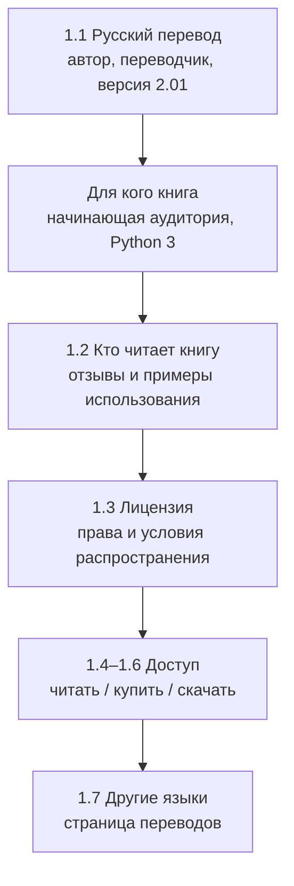

# Chapter logic diagram — «Обложка»

```mermaid
flowchart TD
    A["1.1 Русский перевод<br/>автор, переводчик, версия 2.01"] --> B["Для кого книга<br/>начинающая аудитория, Python 3"]
    B --> C["1.2 Кто читает книгу<br/>отзывы и примеры использования"]
    C --> D["1.3 Лицензия<br/>права и условия распространения"]
    D --> E["1.4–1.6 Доступ<br/>читать / купить / скачать"]
    E --> F["1.7 Другие языки<br/>страница переводов"]
```

## Boundary

`p0009:c01` → `p0014:c01`; следующий chunk `p0015:c01` начинает главу 2
«Переводы».
