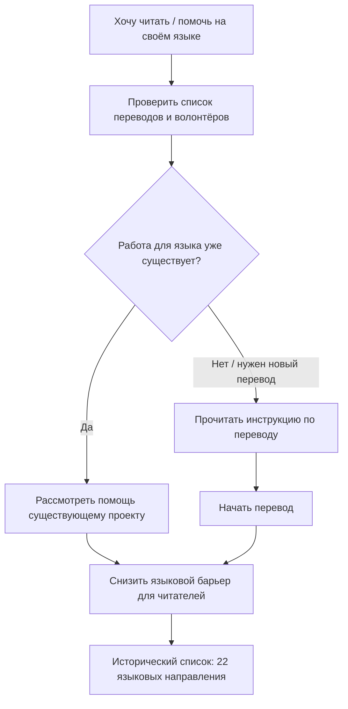

# Chapter logic diagram — «Переводы»

```mermaid
flowchart TD
    A["Хочу читать / помочь на своём языке"] --> B["Проверить список переводов и волонтёров"]
    B --> C{"Работа для языка уже существует?"}
    C -->|"Да"| D["Рассмотреть помощь существующему проекту"]
    C -->|"Нет / нужен новый перевод"| E["Прочитать инструкцию по переводу"]
    E --> F["Начать перевод"]
    D --> G["Снизить языковой барьер для читателей"]
    F --> G
    G --> H["Исторический список: 22 языковых направления"]
```

## Source boundary

`p0015:c01` → `p0022:c01`.

Следующий chunk `p0023:c01` начинается с «Предисловие», то есть главы 3.
