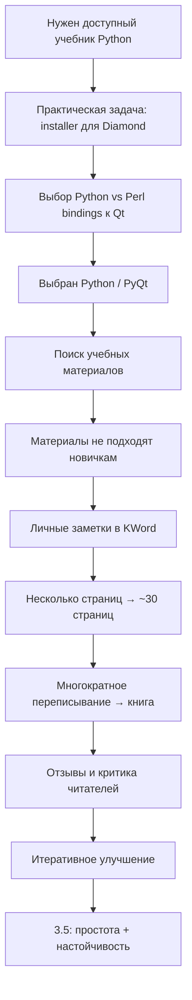

# Chapter logic diagram — «Предисловие»

```mermaid
flowchart TD
    A["Нужен доступный учебник Python"] --> B["Практическая задача: installer для Diamond"]
    B --> C["Выбор Python vs Perl bindings к Qt"]
    C --> D["Выбран Python / PyQt"]
    D --> E["Поиск учебных материалов"]
    E --> F["Материалы не подходят новичкам"]
    F --> G["Личные заметки в KWord"]
    G --> H["Несколько страниц → ~30 страниц"]
    H --> I["Многократное переписывание → книга"]
    I --> J["Отзывы и критика читателей"]
    J --> K["Итеративное улучшение"]
    K --> L["3.5: простота + настойчивость"]
```

## Source boundary

`p0023:c01` → `p0026:c01`.

Следующий chunk `p0027:c01` начинается с «Введение», то есть главы 4.
