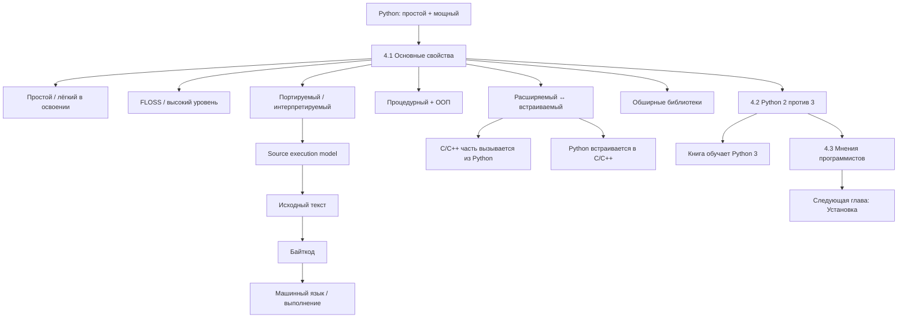

# Chapter logic diagram — «Введение»

```mermaid
flowchart TD
    A["Python: простой + мощный"] --> B["4.1 Основные свойства"]
    B --> B1["Простой / лёгкий в освоении"]
    B --> B2["FLOSS / высокий уровень"]
    B --> B3["Портируемый / интерпретируемый"]
    B --> B4["Процедурный + ООП"]
    B --> B5["Расширяемый ↔ встраиваемый"]
    B --> B6["Обширные библиотеки"]

    B3 --> C["Source execution model"]
    C --> C1["Исходный текст"]
    C1 --> C2["Байткод"]
    C2 --> C3["Машинный язык / выполнение"]

    B5 --> D1["C/C++ часть вызывается из Python"]
    B5 --> D2["Python встраивается в C/C++"]

    B --> E["4.2 Python 2 против 3"]
    E --> E1["Книга обучает Python 3"]

    E --> F["4.3 Мнения программистов"]
    F --> G["Следующая глава: Установка"]
```

## Source boundary

`p0027:c01` → `p0030:c01`.

Следующий chunk `p0031:c01` начинается с «Установка», то есть главы 5.
