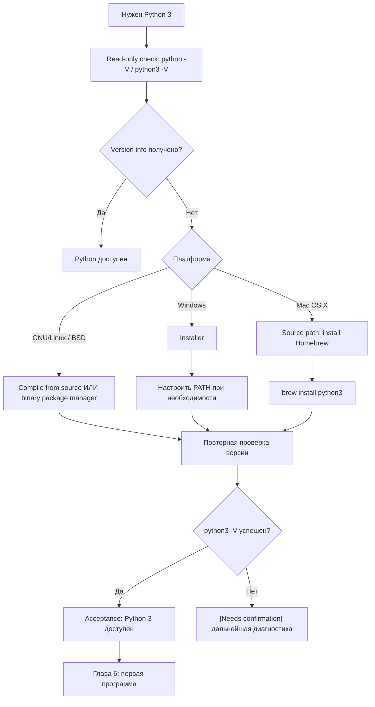

# Chapter logic diagram — «Установка»

```mermaid
flowchart TD
    A["Нужен Python 3"] --> B["Read-only check: python -V / python3 -V"]
    B --> C{"Version info получено?"}
    C -->|"Да"| D["Python доступен"]
    C -->|"Нет"| E{"Платформа"}

    E -->|"GNU/Linux / BSD"| F["Compile from source ИЛИ binary package manager"]
    E -->|"Windows"| G["Installer"]
    G --> H["Настроить PATH при необходимости"]
    E -->|"Mac OS X"| I["Source path: install Homebrew"]
    I --> J["brew install python3"]

    F --> K["Повторная проверка версии"]
    H --> K
    J --> K
    K --> L{"python3 -V успешен?"}
    L -->|"Да"| M["Acceptance: Python 3 доступен"]
    L -->|"Нет"| N["[Needs confirmation] дальнейшая диагностика"]

    M --> O["Глава 6: первая программа"]
```

## Source boundary

`p0031:c01` → `p0034:c01`.

Следующий chunk `p0035:c01` начинается с «Первые шаги», то есть главы 6.
