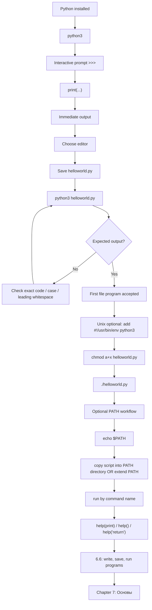

# Chapter logic diagram — «Первые шаги»

```mermaid
flowchart TD
    A["Python installed"] --> B["python3"]
    B --> C["Interactive prompt >>>"]
    C --> D["print(...)"]
    D --> E["Immediate output"]

    E --> F["Choose editor"]
    F --> G["Save helloworld.py"]
    G --> H["python3 helloworld.py"]
    H --> I{"Expected output?"}
    I -->|"No"| J["Check exact code / case / leading whitespace"]
    J --> H
    I -->|"Yes"| K["First file program accepted"]

    K --> L["Unix optional: add #!/usr/bin/env python3"]
    L --> M["chmod a+x helloworld.py"]
    M --> N["./helloworld.py"]

    N --> O["Optional PATH workflow"]
    O --> P["echo $PATH"]
    P --> Q["copy script into PATH directory OR extend PATH"]
    Q --> R["run by command name"]

    R --> S["help(print) / help() / help('return')"]
    S --> T["6.6: write, save, run programs"]
    T --> U["Chapter 7: Основы"]
```

## Source boundary

`p0035:c01` → `p0042:c01`.

Следующий chunk `p0043:c01` начинается с «Основы», то есть главы 7.
