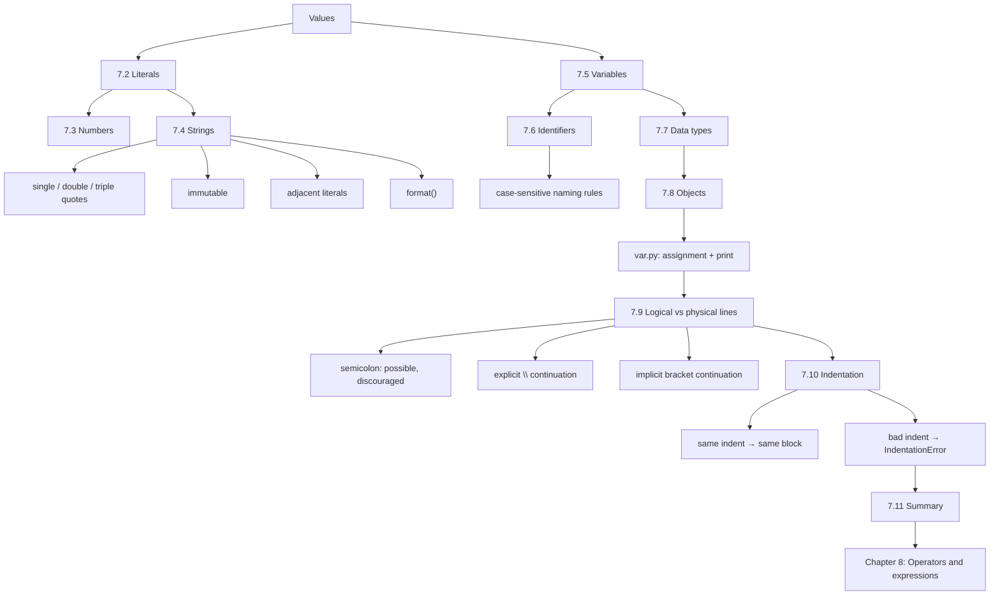

# Chapter logic diagram — «Основы»

```mermaid
flowchart TD
    A["Values"] --> B["7.2 Literals"]
    B --> C["7.3 Numbers"]
    B --> D["7.4 Strings"]

    D --> D1["single / double / triple quotes"]
    D --> D2["immutable"]
    D --> D3["adjacent literals"]
    D --> D4["format()"]

    A --> E["7.5 Variables"]
    E --> F["7.6 Identifiers"]
    F --> G["case-sensitive naming rules"]

    E --> H["7.7 Data types"]
    H --> I["7.8 Objects"]
    I --> J["var.py: assignment + print"]

    J --> K["7.9 Logical vs physical lines"]
    K --> K1["semicolon: possible, discouraged"]
    K --> K2["explicit \\ continuation"]
    K --> K3["implicit bracket continuation"]

    K --> L["7.10 Indentation"]
    L --> M["same indent → same block"]
    L --> N["bad indent → IndentationError"]

    N --> O["7.11 Summary"]
    O --> P["Chapter 8: Operators and expressions"]
```

## Source boundary

`p0043:c01` → `p0052:c01`.

Следующий chunk `p0053:c01` начинается с «Операторы и выражения», то есть главы 8.
