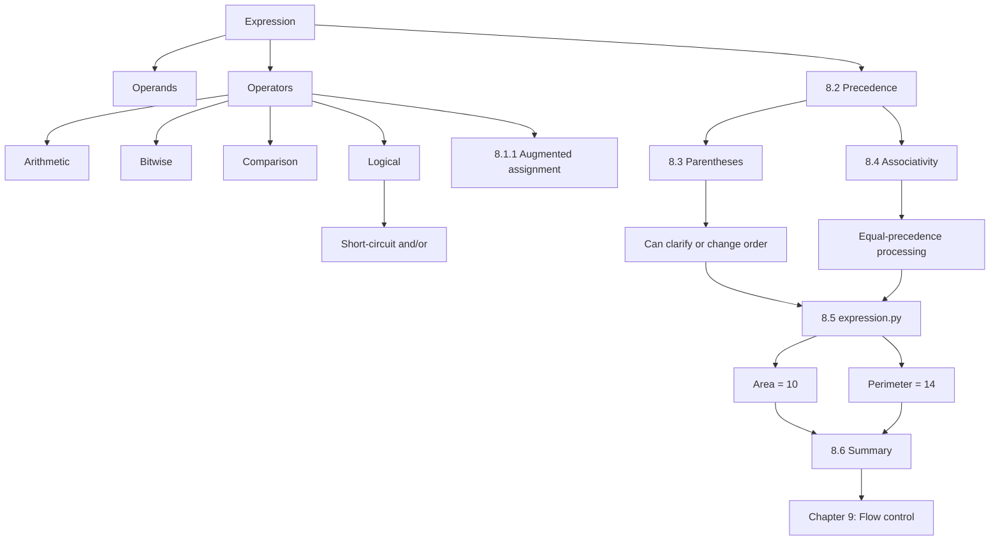

# Chapter logic diagram — «Операторы и выражения»

```mermaid
flowchart TD
    A["Expression"] --> B["Operands"]
    A --> C["Operators"]

    C --> C1["Arithmetic"]
    C --> C2["Bitwise"]
    C --> C3["Comparison"]
    C --> C4["Logical"]

    C4 --> D["Short-circuit and/or"]
    C --> E["8.1.1 Augmented assignment"]

    A --> F["8.2 Precedence"]
    F --> G["8.3 Parentheses"]
    G --> H["Can clarify or change order"]

    F --> I["8.4 Associativity"]
    I --> J["Equal-precedence processing"]

    H --> K["8.5 expression.py"]
    J --> K
    K --> L["Area = 10"]
    K --> M["Perimeter = 14"]

    L --> N["8.6 Summary"]
    M --> N
    N --> O["Chapter 9: Flow control"]
```

## Source boundary

`p0053:c01` → `p0058:c01`.

Следующий chunk `p0059:c01` начинается с «Поток команд», то есть главы 9.
