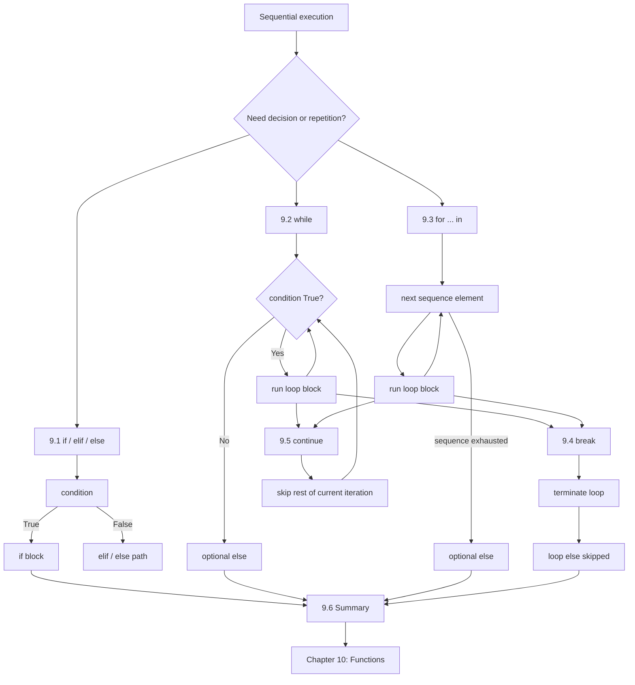

# Chapter logic diagram — «Поток команд»

```mermaid
flowchart TD
    A["Sequential execution"] --> B{"Need decision or repetition?"}

    B --> C["9.1 if / elif / else"]
    C --> C1["condition"]
    C1 -->|"True"| C2["if block"]
    C1 -->|"False"| C3["elif / else path"]

    B --> D["9.2 while"]
    D --> D1{"condition True?"}
    D1 -->|"Yes"| D2["run loop block"]
    D2 --> D1
    D1 -->|"No"| D3["optional else"]

    B --> E["9.3 for ... in"]
    E --> E1["next sequence element"]
    E1 --> E2["run loop block"]
    E2 --> E1
    E1 -->|"sequence exhausted"| E3["optional else"]

    D2 --> F["9.4 break"]
    E2 --> F
    F --> G["terminate loop"]
    G --> H["loop else skipped"]

    D2 --> I["9.5 continue"]
    E2 --> I
    I --> J["skip rest of current iteration"]
    J --> D1

    C2 --> K["9.6 Summary"]
    D3 --> K
    E3 --> K
    H --> K
    K --> L["Chapter 10: Functions"]
```

## Source boundary

`p0059:c01` → `p0066:c01`.

Следующий chunk `p0067:c01` начинается с «Функции», то есть главы 10.
