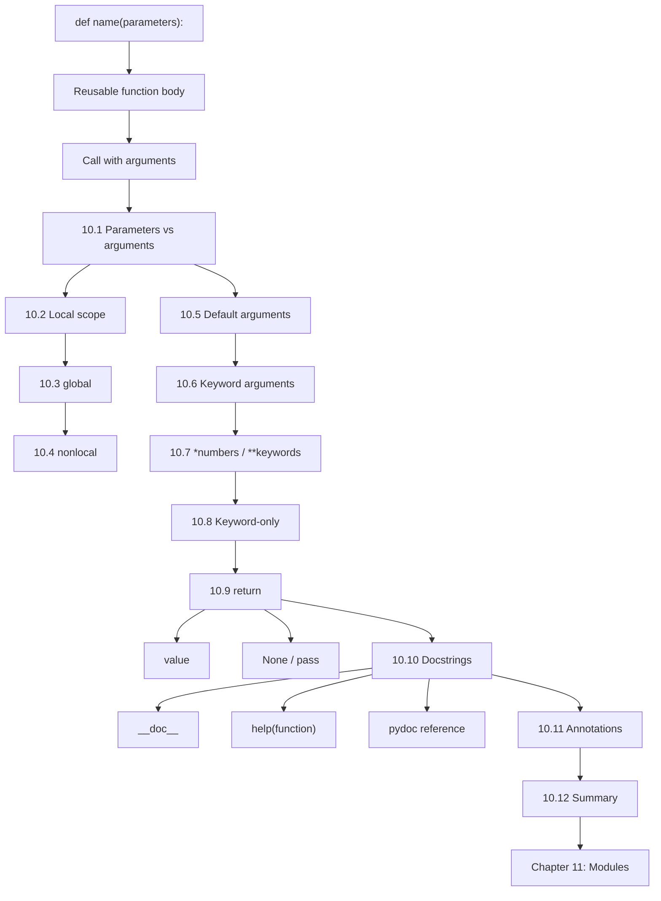

# Chapter logic diagram — «Функции»

```mermaid
flowchart TD
    A["def name(parameters):"] --> B["Reusable function body"]
    B --> C["Call with arguments"]

    C --> D["10.1 Parameters vs arguments"]
    D --> E["10.2 Local scope"]
    E --> F["10.3 global"]
    F --> G["10.4 nonlocal"]

    D --> H["10.5 Default arguments"]
    H --> I["10.6 Keyword arguments"]
    I --> J["10.7 *numbers / **keywords"]
    J --> K["10.8 Keyword-only"]

    K --> L["10.9 return"]
    L --> L1["value"]
    L --> L2["None / pass"]

    L --> M["10.10 Docstrings"]
    M --> M1["__doc__"]
    M --> M2["help(function)"]
    M --> M3["pydoc reference"]

    M --> N["10.11 Annotations"]
    N --> O["10.12 Summary"]
    O --> P["Chapter 11: Modules"]
```

## Source boundary

`p0067:c01` → `p0078:c01`.

Следующий chunk `p0079:c01` начинается с «Модули», то есть главы 11.
