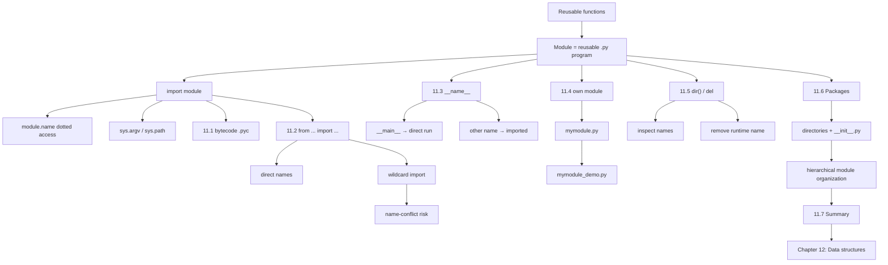

# Chapter logic diagram — «Модули»

```mermaid
flowchart TD
    A["Reusable functions"] --> B["Module = reusable .py program"]
    B --> C["import module"]
    C --> D["module.name dotted access"]

    C --> E["sys.argv / sys.path"]
    C --> F["11.1 bytecode .pyc"]

    C --> G["11.2 from ... import ..."]
    G --> G1["direct names"]
    G --> G2["wildcard import"]
    G2 --> G3["name-conflict risk"]

    B --> H["11.3 __name__"]
    H --> H1["__main__ → direct run"]
    H --> H2["other name → imported"]

    B --> I["11.4 own module"]
    I --> I1["mymodule.py"]
    I1 --> I2["mymodule_demo.py"]

    B --> J["11.5 dir() / del"]
    J --> J1["inspect names"]
    J --> J2["remove runtime name"]

    B --> K["11.6 Packages"]
    K --> K1["directories + __init__.py"]
    K1 --> L["hierarchical module organization"]

    L --> M["11.7 Summary"]
    M --> N["Chapter 12: Data structures"]
```

## Source boundary

`p0079:c01` → `p0086:c01`.

Следующий chunk `p0087:c01` начинается с «Структуры данных», то есть главы 12.
