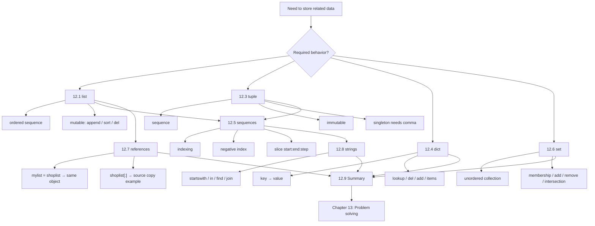

# Chapter logic diagram — «Структуры данных»

```mermaid
flowchart TD
    A["Need to store related data"] --> B{"Required behavior?"}

    B --> C["12.1 list"]
    C --> C1["ordered sequence"]
    C --> C2["mutable: append / sort / del"]

    B --> D["12.3 tuple"]
    D --> D1["sequence"]
    D --> D2["immutable"]
    D --> D3["singleton needs comma"]

    B --> E["12.4 dict"]
    E --> E1["key → value"]
    E --> E2["lookup / del / add / items"]

    B --> F["12.6 set"]
    F --> F1["unordered collection"]
    F --> F2["membership / add / remove / intersection"]

    C --> G["12.5 sequences"]
    D --> G
    G --> G1["indexing"]
    G --> G2["negative index"]
    G --> G3["slice start:end:step"]

    C --> H["12.7 references"]
    H --> H1["mylist = shoplist → same object"]
    H --> H2["shoplist[:] → source copy example"]

    G --> I["12.8 strings"]
    I --> I1["startswith / in / find / join"]

    E --> J["12.9 Summary"]
    F --> J
    H --> J
    I --> J
    J --> K["Chapter 13: Problem solving"]
```

## Source boundary

`p0087:c01` → `p0098:c01`.

Следующий chunk `p0099:c01` начинается с «Решение задач», то есть главы 13.
