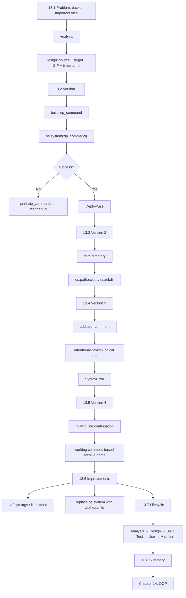

# Chapter logic diagram — «Решение задач»

```mermaid
flowchart TD
    A["13.1 Problem: backup important files"] --> B["Analysis"]
    B --> C["Design: source + target + ZIP + timestamp"]
    C --> D["13.2 Version 1"]
    D --> D1["build zip_command"]
    D1 --> D2["os.system(zip_command)"]
    D2 --> D3{"success?"}
    D3 -->|"No"| E["print zip_command → test/debug"]
    D3 -->|"Yes"| F["Deploy/use"]

    F --> G["13.3 Version 2"]
    G --> G1["date directory"]
    G1 --> G2["os.path.exists / os.mkdir"]

    G2 --> H["13.4 Version 3"]
    H --> H1["add user comment"]
    H1 --> H2["intentional broken logical line"]
    H2 --> H3["SyntaxError"]

    H3 --> I["13.5 Version 4"]
    I --> I1["fix with line continuation"]
    I1 --> I2["working comment-based archive name"]

    I2 --> J["13.6 Improvements"]
    J --> J1["-v / sys.argv / list.extend"]
    J --> J2["replace os.system with zipfile/tarfile"]

    J --> K["13.7 Lifecycle"]
    K --> K1["Analysis → Design → Build → Test → Use → Maintain"]
    K1 --> L["13.8 Summary"]
    L --> M["Chapter 14: OOP"]
```

## Source boundary

`p0099:c01` → `p0108:c01`.

Следующий chunk `p0109:c01` начинается с «Объектно-ориентированное
программирование», то есть главы 14.
