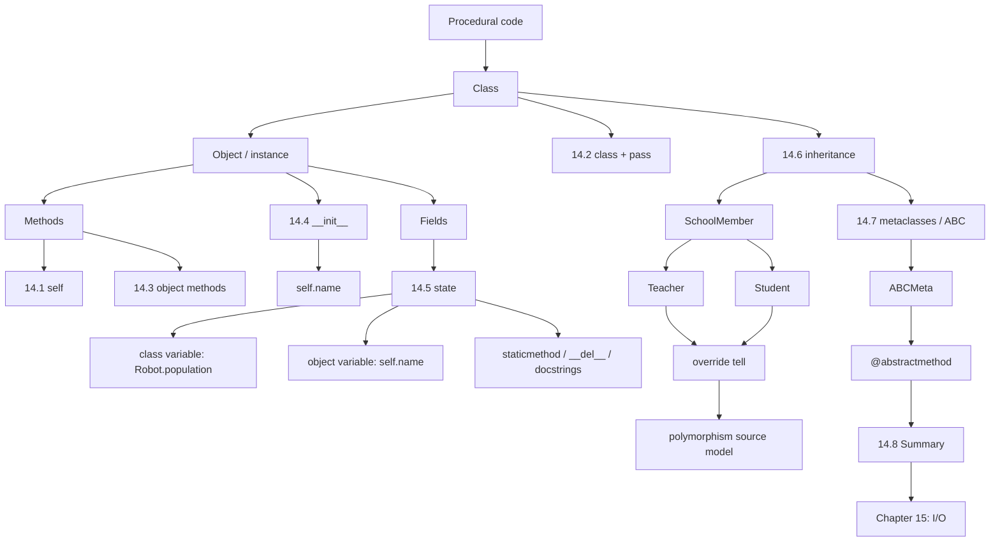

# Chapter logic diagram — «Объектно-ориентированное программирование»

```mermaid
flowchart TD
    A["Procedural code"] --> B["Class"]
    B --> C["Object / instance"]
    C --> D["Fields"]
    C --> E["Methods"]

    E --> F["14.1 self"]
    B --> G["14.2 class + pass"]
    E --> H["14.3 object methods"]
    C --> I["14.4 __init__"]
    I --> I1["self.name"]

    D --> J["14.5 state"]
    J --> J1["class variable: Robot.population"]
    J --> J2["object variable: self.name"]
    J --> J3["staticmethod / __del__ / docstrings"]

    B --> K["14.6 inheritance"]
    K --> K1["SchoolMember"]
    K1 --> K2["Teacher"]
    K1 --> K3["Student"]
    K2 --> K4["override tell"]
    K3 --> K4
    K4 --> K5["polymorphism source model"]

    K --> L["14.7 metaclasses / ABC"]
    L --> L1["ABCMeta"]
    L1 --> L2["@abstractmethod"]

    L2 --> M["14.8 Summary"]
    M --> N["Chapter 15: I/O"]
```

## Source boundary

`p0109:c01` → `p0120:c01`.

Следующий chunk `p0121:c01` начинается с «Ввод-вывод», то есть главы 15.
