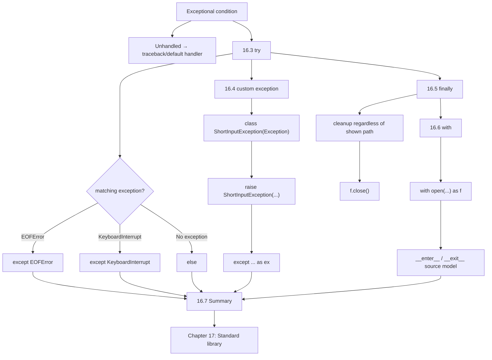

# Chapter logic diagram — «Исключения»

```mermaid
flowchart TD
    A["Exceptional condition"] --> B["Unhandled → traceback/default handler"]

    A --> C["16.3 try"]
    C --> D{"matching exception?"}
    D -->|"EOFError"| E["except EOFError"]
    D -->|"KeyboardInterrupt"| F["except KeyboardInterrupt"]
    D -->|"No exception"| G["else"]

    C --> H["16.4 custom exception"]
    H --> H1["class ShortInputException(Exception)"]
    H1 --> H2["raise ShortInputException(...)"]
    H2 --> H3["except ... as ex"]

    C --> I["16.5 finally"]
    I --> I1["cleanup regardless of shown path"]
    I1 --> I2["f.close()"]

    I --> J["16.6 with"]
    J --> J1["with open(...) as f"]
    J1 --> J2["__enter__ / __exit__ source model"]

    E --> K["16.7 Summary"]
    F --> K
    G --> K
    H3 --> K
    J2 --> K
    K --> L["Chapter 17: Standard library"]
```

## Source boundary

`p0127:c01` → `p0132:c01`.

Следующий chunk `p0133:c01` начинается с «Стандартная библиотека», то есть главы 17.
