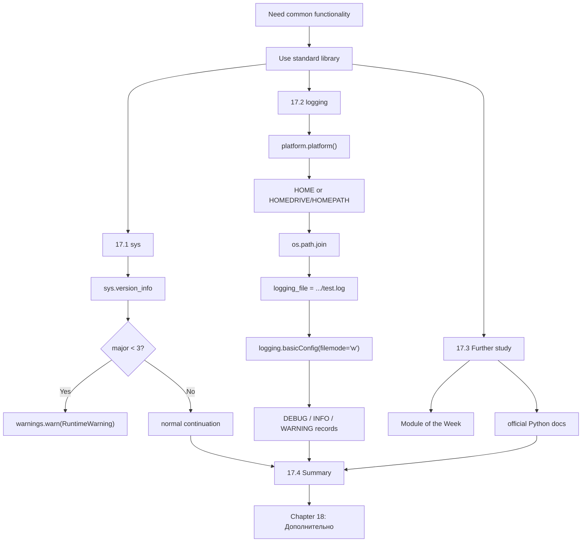

# Chapter logic diagram — «Стандартная библиотека»

```mermaid
flowchart TD
    A["Need common functionality"] --> B["Use standard library"]

    B --> C["17.1 sys"]
    C --> C1["sys.version_info"]
    C1 --> C2{"major < 3?"}
    C2 -->|"Yes"| C3["warnings.warn(RuntimeWarning)"]
    C2 -->|"No"| C4["normal continuation"]

    B --> D["17.2 logging"]
    D --> D1["platform.platform()"]
    D1 --> D2["HOME or HOMEDRIVE/HOMEPATH"]
    D2 --> D3["os.path.join"]
    D3 --> D4["logging_file = .../test.log"]
    D4 --> D5["logging.basicConfig(filemode='w')"]
    D5 --> D6["DEBUG / INFO / WARNING records"]

    B --> E["17.3 Further study"]
    E --> E1["Module of the Week"]
    E --> E2["official Python docs"]

    C4 --> F["17.4 Summary"]
    D6 --> F
    E2 --> F
    F --> G["Chapter 18: Дополнительно"]
```

## Source boundary

`p0133:c01` → `p0136:c01`.

Следующий chunk `p0137:c01` начинается с «Дополнительно», то есть главы 18.
