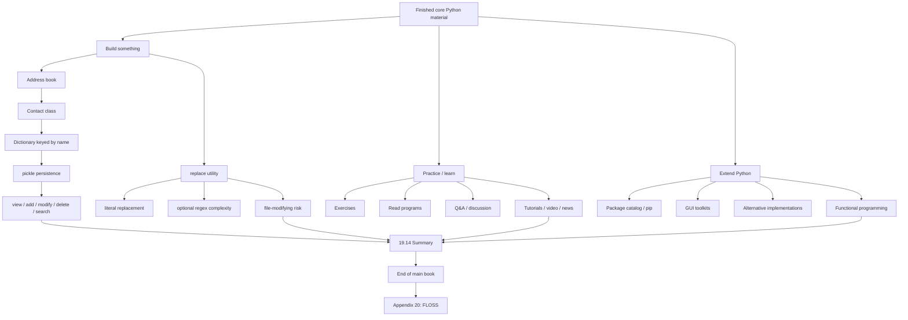

# Chapter logic diagram — «Что дальше»

```mermaid
flowchart TD
    A["Finished core Python material"] --> B["Build something"]

    B --> C["Address book"]
    C --> C1["Contact class"]
    C1 --> C2["Dictionary keyed by name"]
    C2 --> C3["pickle persistence"]
    C3 --> C4["view / add / modify / delete / search"]

    B --> D["replace utility"]
    D --> D1["literal replacement"]
    D --> D2["optional regex complexity"]
    D --> D3["file-modifying risk"]

    A --> E["Practice / learn"]
    E --> E1["Exercises"]
    E --> E2["Read programs"]
    E --> E3["Q&A / discussion"]
    E --> E4["Tutorials / video / news"]

    A --> F["Extend Python"]
    F --> F1["Package catalog / pip"]
    F --> F2["GUI toolkits"]
    F --> F3["Alternative implementations"]
    F --> F4["Functional programming"]

    C4 --> G["19.14 Summary"]
    D3 --> G
    E4 --> G
    F4 --> G
    G --> H["End of main book"]
    H --> I["Appendix 20: FLOSS"]
```

## Source boundary

`p0145:c01` → `p0150:c01`.

Следующий chunk `p0151:c01` начинается с «Приложение: FLOSS», то есть приложения 20.
