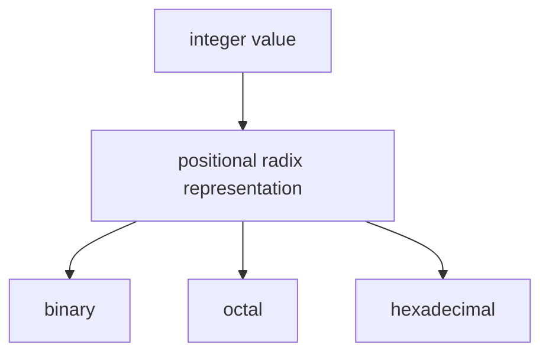
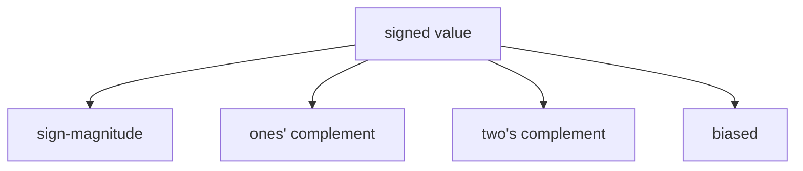
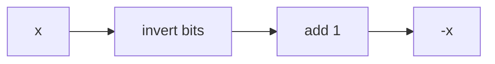
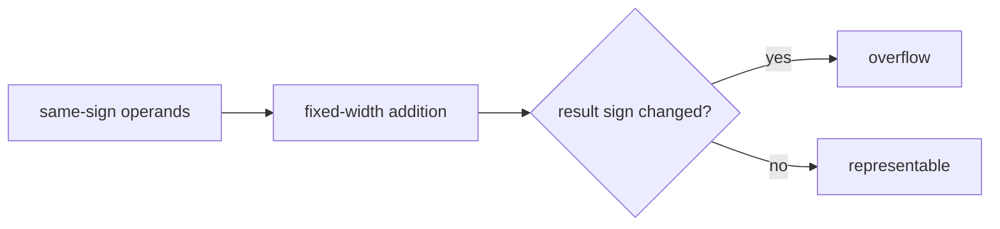

# Mermaid — Appendix A

## Number representation

```mermaid
flowchart TD
  N["integer value"] --> POS["positional radix representation"]
  POS --> BIN["binary"]
  POS --> OCT["octal"]
  POS --> HEX["hexadecimal"]
```

## Signed binary

```mermaid
flowchart TD
  S["signed value"] --> SM["sign-magnitude"]
  S --> OC["ones' complement"]
  S --> TC["two's complement"]
  S --> B["biased"]
```

## Two's-complement negation

```mermaid
flowchart LR
  X["x"] --> INV["invert bits"]
  INV --> ADD["add 1"]
  ADD --> NEG["-x"]
```

## Overflow

```mermaid
flowchart LR
  A["same-sign operands"] --> SUM["fixed-width addition"]
  SUM --> TEST{"result sign changed?"}
  TEST -->|yes| OV["overflow"]
  TEST -->|no| OK["representable"]
```
