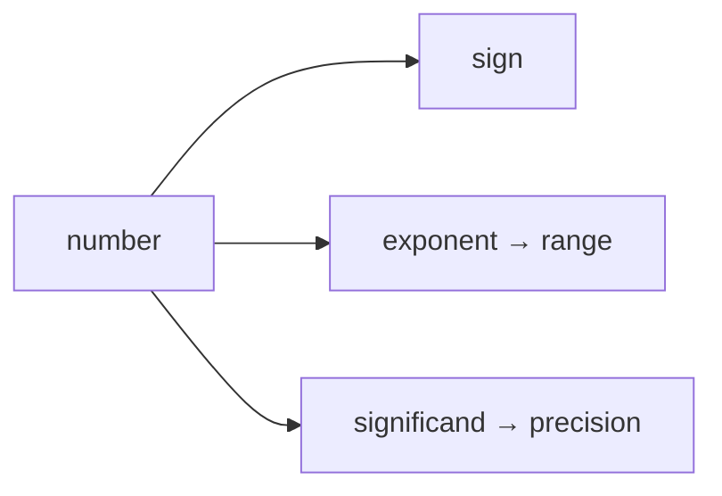
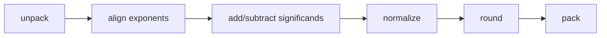
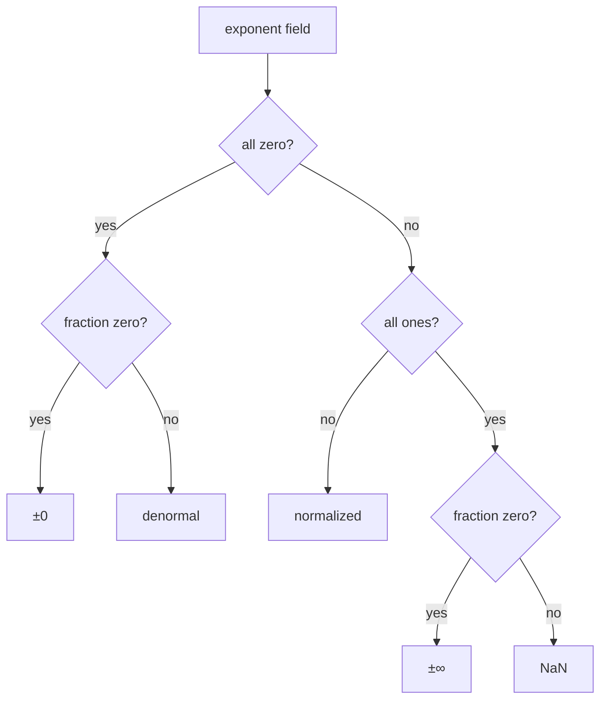

# Mermaid — Appendix B

## Floating-point decomposition

```mermaid
flowchart LR
  N["number"] --> S["sign"]
  N --> E["exponent → range"]
  N --> M["significand → precision"]
```

## Addition

```mermaid
flowchart LR
  A["unpack"] --> E["align exponents"]
  E --> S["add/subtract significands"]
  S --> N["normalize"]
  N --> R["round"]
  R --> P["pack"]
```

## IEEE classes

```mermaid
flowchart TD
  E["exponent field"] --> Z{"all zero?"}
  Z -->|yes| F0{"fraction zero?"}
  F0 -->|yes| ZERO["±0"]
  F0 -->|no| SUB["denormal"]
  Z -->|no| ONES{"all ones?"}
  ONES -->|no| NORM["normalized"]
  ONES -->|yes| F1{"fraction zero?"}
  F1 -->|yes| INF["±∞"]
  F1 -->|no| NAN["NaN"]
```
