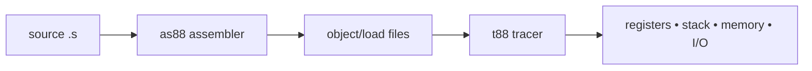
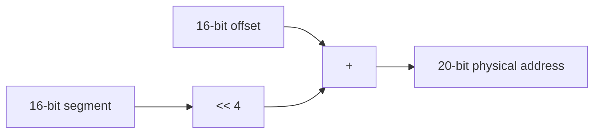
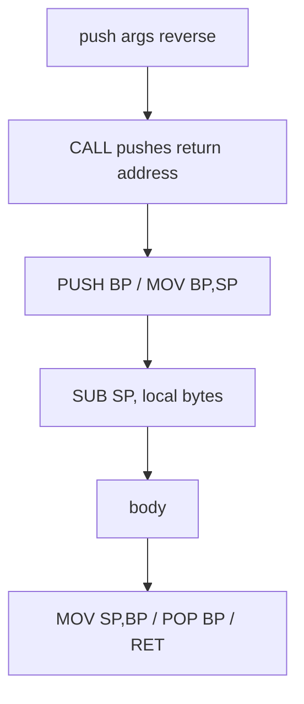
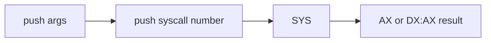

# Mermaid — Appendix C

## Toolchain

```mermaid
flowchart LR
  S["source .s"] --> A["as88 assembler"]
  A --> O["object/load files"]
  O --> T["t88 tracer"]
  T --> R["registers • stack • memory • I/O"]
```

## Address formation

```mermaid
flowchart LR
  SEG["16-bit segment"] --> SH["<< 4"]
  OFF["16-bit offset"] --> ADD["+"]
  SH --> ADD
  ADD --> PA["20-bit physical address"]
```

## Call frame

```mermaid
flowchart TD
  ARGS["push args reverse"] --> CALL["CALL pushes return address"]
  CALL --> BP["PUSH BP / MOV BP,SP"]
  BP --> LOC["SUB SP, local bytes"]
  LOC --> BODY["body"]
  BODY --> EP["MOV SP,BP / POP BP / RET"]
```

## System call

```mermaid
flowchart LR
  ARG["push args"] --> NUM["push syscall number"]
  NUM --> SYS["SYS"]
  SYS --> RET["AX or DX:AX result"]
```
