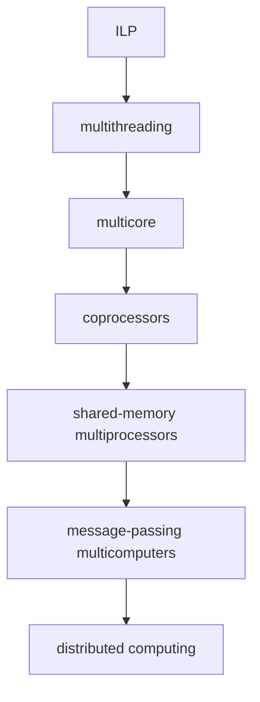
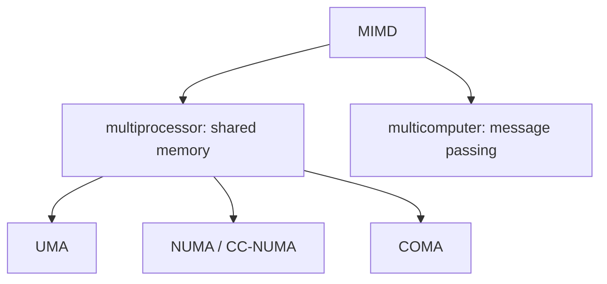
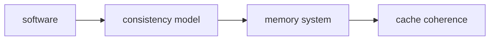
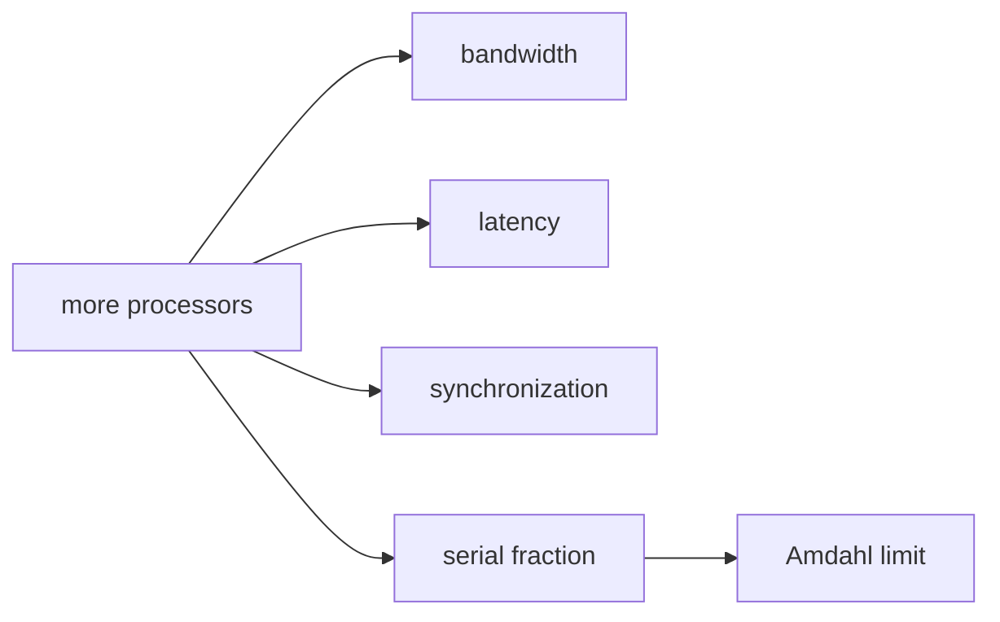

# Mermaid — глава 8 «Параллельные компьютерные архитектуры»

Источник: RAG `p0590:c01`–`p0698:c01`.

## Иерархия параллелизма

```mermaid
flowchart TD
  A["ILP"] --> B["multithreading"]
  B --> C["multicore"]
  C --> D["coprocessors"]
  D --> E["shared-memory multiprocessors"]
  E --> F["message-passing multicomputers"]
  F --> G["distributed computing"]
```

## MIMD

```mermaid
flowchart TD
  M["MIMD"] --> MP["multiprocessor: shared memory"]
  M --> MC["multicomputer: message passing"]
  MP --> UMA["UMA"]
  MP --> NUMA["NUMA / CC-NUMA"]
  MP --> COMA["COMA"]
```

## Memory contract

```mermaid
flowchart LR
  SW["software"] --> CONS["consistency model"]
  CONS --> HW["memory system"]
  HW --> COH["cache coherence"]
```

## Scaling

```mermaid
flowchart LR
  P["more processors"] --> BW["bandwidth"]
  P --> LAT["latency"]
  P --> SYNC["synchronization"]
  P --> SERIAL["serial fraction"]
  SERIAL --> AMD["Amdahl limit"]
```
