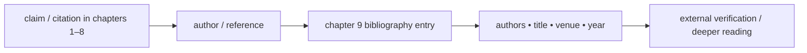
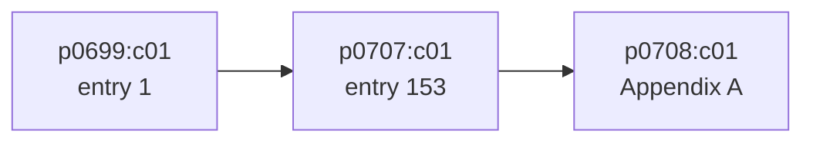
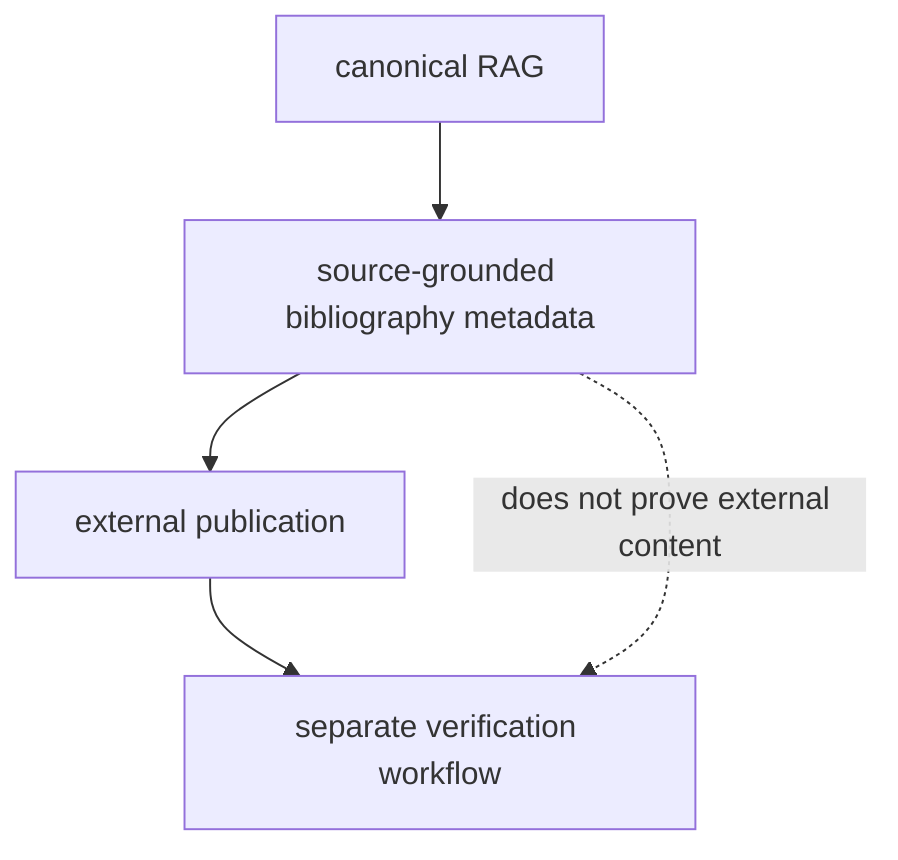
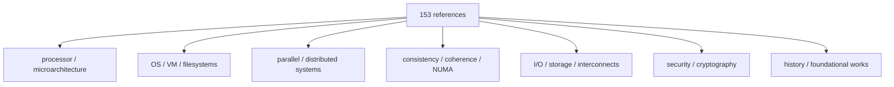

# Mermaid — глава 9 «Библиография»

Источник: RAG `p0699:c01`–`p0707:c01`.

## Bibliography workflow

```mermaid
flowchart LR
  C["claim / citation in chapters 1–8"] --> A["author / reference"]
  A --> B["chapter 9 bibliography entry"]
  B --> M["authors • title • venue • year"]
  M --> X["external verification / deeper reading"]
```

## Source boundary

```mermaid
flowchart LR
  P699["p0699:c01<br/>entry 1"] --> P707["p0707:c01<br/>entry 153"]
  P707 --> P708["p0708:c01<br/>Appendix A"]
```

## Trust boundary

```mermaid
flowchart TD
  R["canonical RAG"] --> G["source-grounded bibliography metadata"]
  G --> E["external publication"]
  E --> V["separate verification workflow"]
  G -. "does not prove external content" .-> V
```

## Thematic navigation

```mermaid
flowchart TD
  BIB["153 references"] --> CPU["processor / microarchitecture"]
  BIB --> OS["OS / VM / filesystems"]
  BIB --> PAR["parallel / distributed systems"]
  BIB --> MEM["consistency / coherence / NUMA"]
  BIB --> IO["I/O / storage / interconnects"]
  BIB --> SEC["security / cryptography"]
  BIB --> HIST["history / foundational works"]
```
