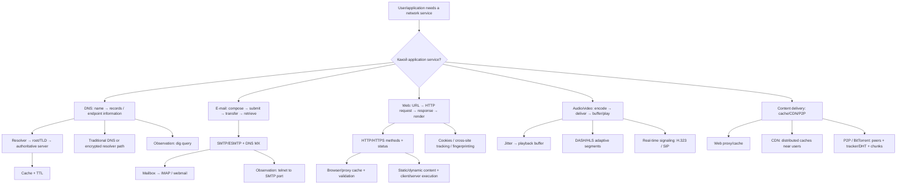

# Диаграмма: логика главы 7

```mermaid
flowchart TD
    start["User/application needs a network service"] --> classify{"Какой application service?"}

    classify --> dns["DNS: name → records / endpoint information"]
    classify --> mail["E-mail: compose → submit → transfer → retrieve"]
    classify --> web["Web: URL → HTTP request → response → render"]
    classify --> media["Audio/video: encode → deliver → buffer/play"]
    classify --> content["Content delivery: cache/CDN/P2P"]

    dns --> resolve["Resolver → root/TLD → authoritative server"]
    resolve --> cache["Cache + TTL"]
    dns --> privacy["Traditional DNS or encrypted resolver path"]
    dns --> dig["Observation: dig query"]

    mail --> smtp["SMTP/ESMTP + DNS MX"]
    smtp --> mailbox["Mailbox → IMAP / webmail"]
    smtp --> telnet["Observation: telnet to SMTP port"]

    web --> http["HTTP/HTTPS methods + status"]
    http --> webcache["Browser/proxy cache + validation"]
    http --> dynamic["Static/dynamic content + client/server execution"]
    web --> tracking["Cookies / cross-site tracking / fingerprinting"]

    media --> buffer["Jitter → playback buffer"]
    media --> adaptive["DASH/HLS adaptive segments"]
    media --> realtime["Real-time signaling: H.323 / SIP"]

    content --> proxy["Web proxy/cache"]
    content --> cdn["CDN: distributed caches near users"]
    content --> p2p["P2P / BitTorrent: peers + tracker/DHT + chunks"]
```

Диаграмма отражает пять крупных application-domain ветвей главы и связи между naming, request/response, media delivery и distribution architectures.
