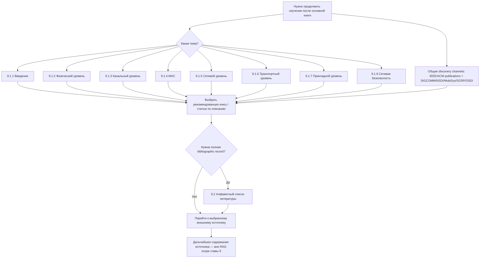

# Диаграмма: как использовать главу 9

```mermaid
flowchart TD
    start["Нужно продолжить изучение после основной книги"] --> topic{"Какая тема?"}

    topic --> intro["9.1.1 Введение"]
    topic --> phy["9.1.2 Физический уровень"]
    topic --> dl["9.1.3 Канальный уровень"]
    topic --> mac["9.1.4 MAC"]
    topic --> net["9.1.5 Сетевой уровень"]
    topic --> trans["9.1.6 Транспортный уровень"]
    topic --> app["9.1.7 Прикладной уровень"]
    topic --> sec["9.1.8 Сетевая безопасность"]

    intro --> pick["Выбрать рекомендованную книгу / статью по описанию"]
    phy --> pick
    dl --> pick
    mac --> pick
    net --> pick
    trans --> pick
    app --> pick
    sec --> pick

    start --> channels["Общие discovery channels: IEEE/ACM publications + SIGCOMM/NSDI/MobiSys/SOSP/OSDI"]
    channels --> pick

    pick --> full{"Нужна полная bibliographic record?"}
    full -->|Да| bibliography["9.2 Алфавитный список литературы"]
    full -->|Нет| external["Перейти к выбранному внешнему источнику"]
    bibliography --> external

    external --> boundary["Дальнейшее содержание источника — вне RAG scope главы 9"]
```

Диаграмма отражает реальную функцию главы: thematic discovery через 9.1 и справочный поиск полной записи через 9.2.
