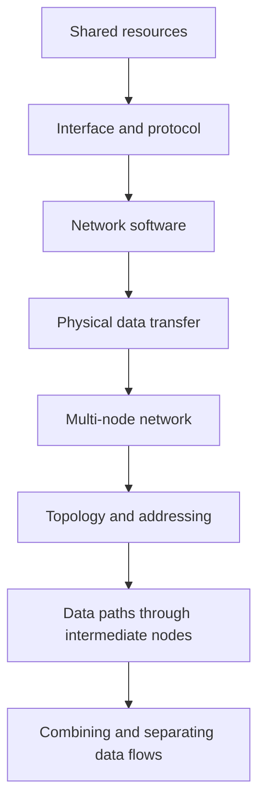

# Chapter 2 diagram

```mermaid
flowchart TD
    A[Shared resources] --> B[Interface and protocol]
    B --> C[Network software]
    C --> D[Physical data transfer]
    D --> E[Multi-node network]
    E --> F[Topology and addressing]
    F --> G[Data paths through intermediate nodes]
    G --> H[Combining and separating data flows]
```

Source scope: PDF 41-74. PDF 47 is unavailable in addressable RAG.
