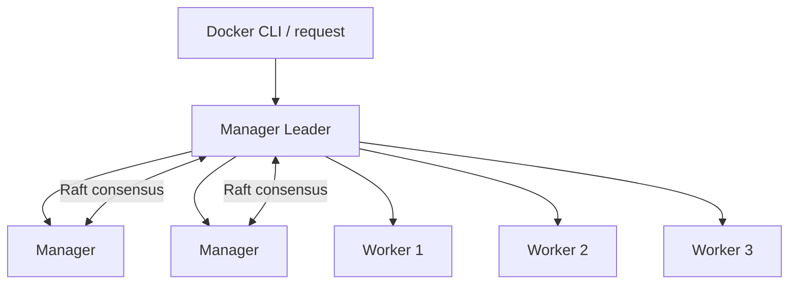
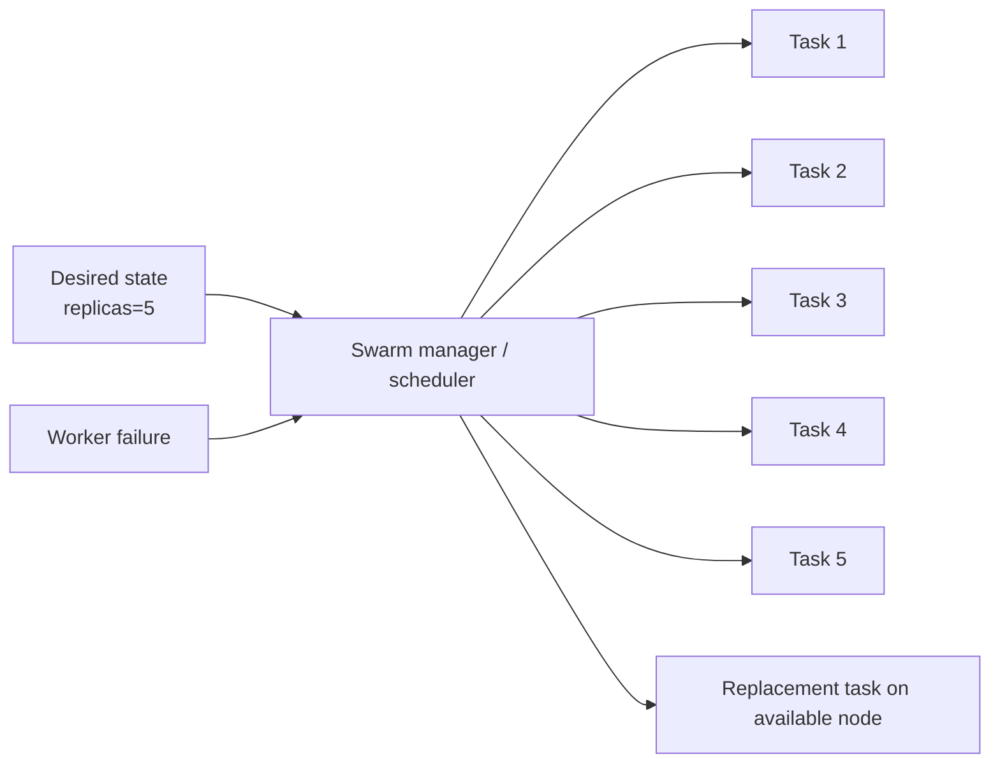
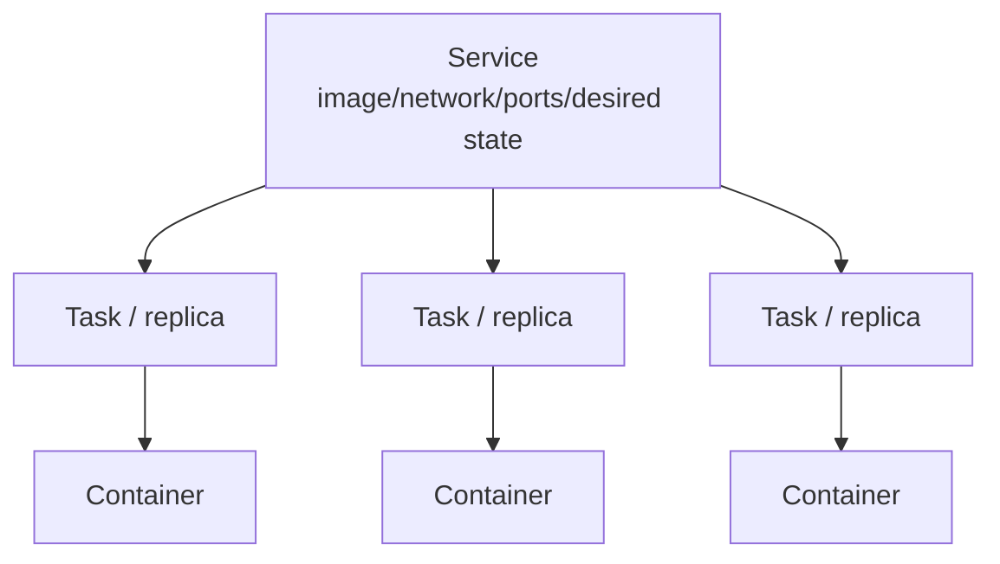
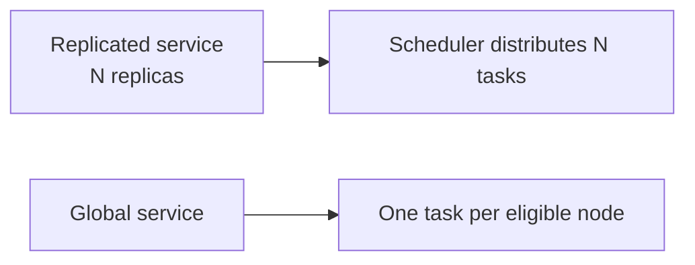
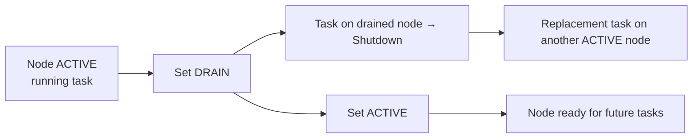
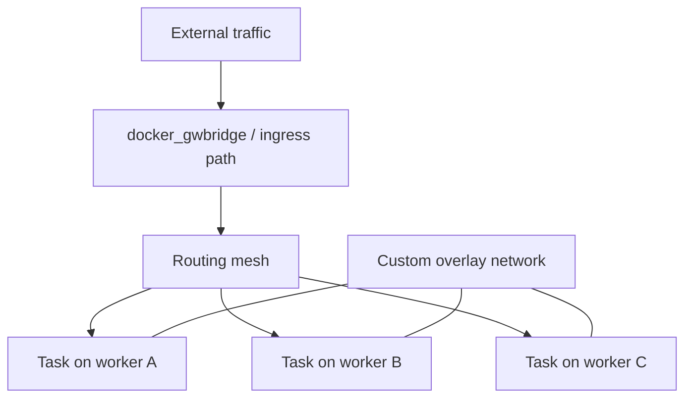
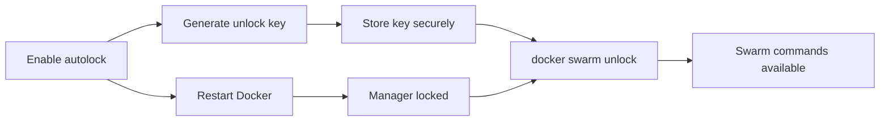
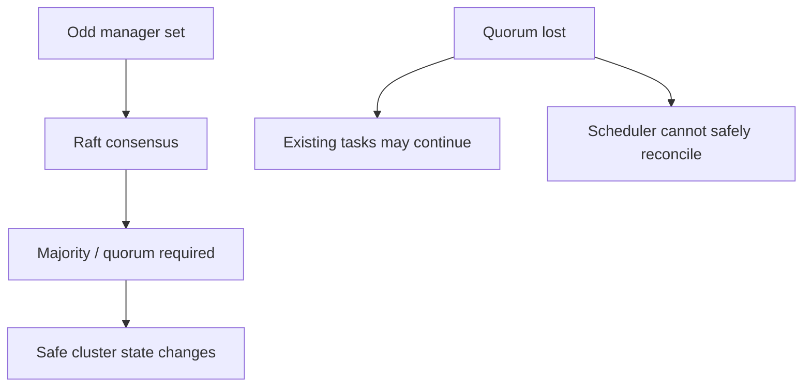

# Диаграммы: Docker Swarm

## Cluster roles

```mermaid
flowchart TB
    C["Docker CLI / request"] --> L["Manager Leader"]
    L --> M2["Manager"]
    L --> M3["Manager"]
    L --> W1["Worker 1"]
    L --> W2["Worker 2"]
    L --> W3["Worker 3"]
    M2 <-->|Raft consensus| L
    M3 <-->|Raft consensus| L
```

## Desired state reconciliation

```mermaid
flowchart LR
    D["Desired state
replicas=5"] --> S["Swarm manager / scheduler"]
    S --> T1["Task 1"]
    S --> T2["Task 2"]
    S --> T3["Task 3"]
    S --> T4["Task 4"]
    S --> T5["Task 5"]
    F["Worker failure"] --> S
    S --> R["Replacement task on available node"]
```

## Service hierarchy

```mermaid
flowchart TB
    SV["Service
image/network/ports/desired state"] --> T1["Task / replica"]
    SV --> T2["Task / replica"]
    SV --> T3["Task / replica"]
    T1 --> C1["Container"]
    T2 --> C2["Container"]
    T3 --> C3["Container"]
```

## Replicated vs global

```mermaid
flowchart LR
    REP["Replicated service
N replicas"] --> N1["Scheduler distributes N tasks"]
    G["Global service"] --> N2["One task per eligible node"]
```

## Drain workflow

```mermaid
flowchart LR
    A["Node ACTIVE
running task"] --> D["Set DRAIN"]
    D --> STOP["Task on drained node → Shutdown"]
    STOP --> NEW["Replacement task on another ACTIVE node"]
    D --> BACK["Set ACTIVE"]
    BACK --> READY["Node ready for future tasks"]
```

## Swarm network

```mermaid
flowchart TB
    EXT["External traffic"] --> GW["docker_gwbridge / ingress path"]
    GW --> RM["Routing mesh"]
    RM --> T1["Task on worker A"]
    RM --> T2["Task on worker B"]
    RM --> T3["Task on worker C"]
    O["Custom overlay network"] --- T1
    O --- T2
    O --- T3
```

## Autolock

```mermaid
flowchart LR
    E["Enable autolock"] --> K["Generate unlock key"]
    K --> SAFE["Store key securely"]
    E --> R["Restart Docker"]
    R --> LOCK["Manager locked"]
    SAFE --> U["docker swarm unlock"]
    LOCK --> U
    U --> OK["Swarm commands available"]
```

## Quorum

```mermaid
flowchart TB
    Q["Odd manager set"] --> R["Raft consensus"]
    R --> MAJ["Majority / quorum required"]
    MAJ --> CHANGE["Safe cluster state changes"]
    LOST["Quorum lost"] --> RUN["Existing tasks may continue"]
    LOST --> NO["Scheduler cannot safely reconcile"]
```
