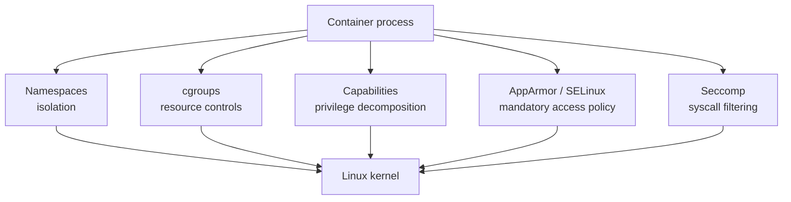
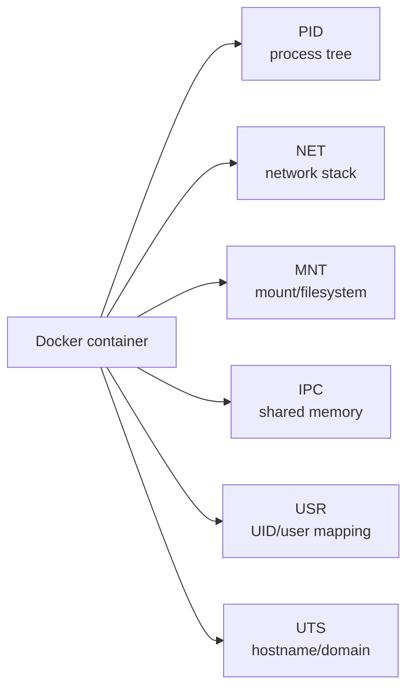
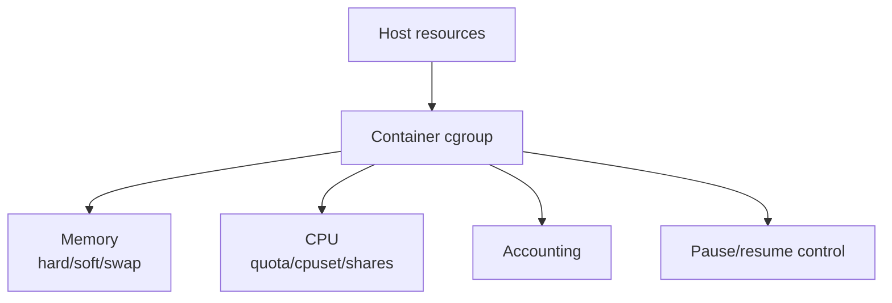
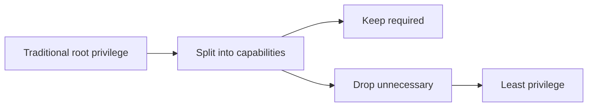
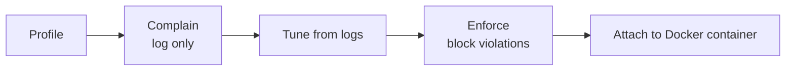
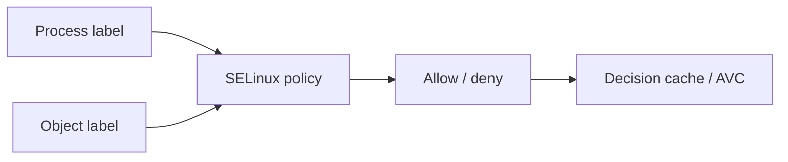
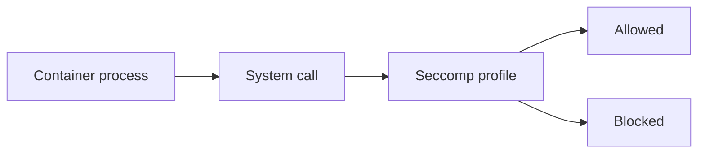

# Диаграммы: Docker security — часть 1

## Defense layers

```mermaid
flowchart TB
    C["Container process"] --> NS["Namespaces<br/>isolation"]
    C --> CG["cgroups<br/>resource controls"]
    C --> CAP["Capabilities<br/>privilege decomposition"]
    C --> MAC["AppArmor / SELinux<br/>mandatory access policy"]
    C --> SC["Seccomp<br/>syscall filtering"]
    NS --> K["Linux kernel"]
    CG --> K
    CAP --> K
    MAC --> K
    SC --> K
```

## Namespace map

```mermaid
flowchart LR
    D["Docker container"] --> PID["PID<br/>process tree"]
    D --> NET["NET<br/>network stack"]
    D --> MNT["MNT<br/>mount/filesystem"]
    D --> IPC["IPC<br/>shared memory"]
    D --> USR["USR<br/>UID/user mapping"]
    D --> UTS["UTS<br/>hostname/domain"]
```

## Cgroup resource boundary

```mermaid
flowchart TB
    H["Host resources"] --> CG["Container cgroup"]
    CG --> MEM["Memory<br/>hard/soft/swap"]
    CG --> CPU["CPU<br/>quota/cpuset/shares"]
    CG --> ACC["Accounting"]
    CG --> CTRL["Pause/resume control"]
```

## Capabilities

```mermaid
flowchart LR
    ROOT["Traditional root privilege"] --> SPLIT["Split into capabilities"]
    SPLIT --> KEEP["Keep required"]
    SPLIT --> DROP["Drop unnecessary"]
    DROP --> LP["Least privilege"]
```

## AppArmor lifecycle

```mermaid
flowchart LR
    P["Profile"] --> C["Complain<br/>log only"]
    C --> T["Tune from logs"]
    T --> E["Enforce<br/>block violations"]
    E --> D["Attach to Docker container"]
```

## SELinux decision model

```mermaid
flowchart LR
    PROC["Process label"] --> POLICY["SELinux policy"]
    OBJ["Object label"] --> POLICY
    POLICY --> DEC["Allow / deny"]
    DEC --> AVC["Decision cache / AVC"]
```

## Seccomp

```mermaid
flowchart LR
    APP["Container process"] --> CALL["System call"]
    CALL --> FILTER["Seccomp profile"]
    FILTER --> ALLOW["Allowed"]
    FILTER --> DENY["Blocked"]
```
