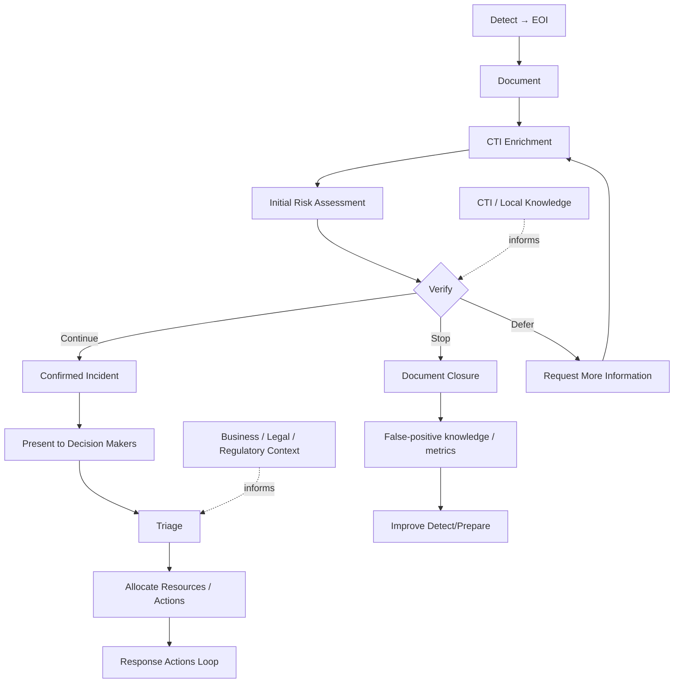

# Диаграмма: Verify and Triage

```mermaid
flowchart TD
    A["Detect → EOI"] --> B["Document"]
    B --> C["CTI Enrichment"]
    C --> D["Initial Risk Assessment"]
    D --> E{"Verify"}

    E -->|Continue| F["Confirmed Incident"]
    E -->|Stop| G["Document Closure"]
    E -->|Defer| H["Request More Information"]

    H --> C

    F --> I["Present to Decision Makers"]
    I --> J["Triage"]
    J --> K["Allocate Resources / Actions"]
    K --> L["Response Actions Loop"]

    G --> M["False-positive knowledge / metrics"]
    M --> N["Improve Detect/Prepare"]

    O["Business / Legal / Regulatory Context"] -. informs .-> J
    P["CTI / Local Knowledge"] -. informs .-> E
```

## Interpretation

Verify — gate.

Triage — prioritization/coordination bridge between technical confirmation and operational response.
