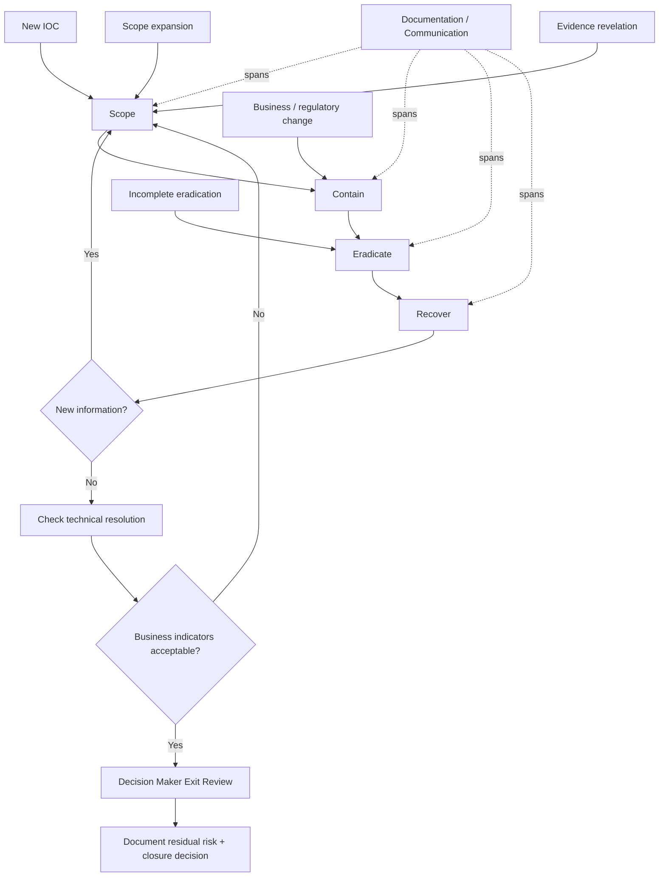

# Диаграмма: Response Actions Loop

```mermaid
flowchart TD
    A["Scope"] --> B["Contain"]
    B --> C["Eradicate"]
    C --> D["Recover"]

    D --> E{"New information?"}
    E -->|Yes| A
    E -->|No| F["Check technical resolution"]

    G["New IOC"] --> A
    H["Scope expansion"] --> A
    I["Incomplete eradication"] --> C
    J["Evidence revelation"] --> A
    K["Business / regulatory change"] --> B

    F --> L{"Business indicators acceptable?"}
    L -->|No| A
    L -->|Yes| M["Decision Maker Exit Review"]

    M --> N["Document residual risk + closure decision"]

    O["Documentation / Communication"] -. spans .-> A
    O -. spans .-> B
    O -. spans .-> C
    O -. spans .-> D
```

## Interpretation

Loop exit is not a purely technical event.

It requires both:
- technical resolution evidence;
- organizational acceptance of residual risk.
