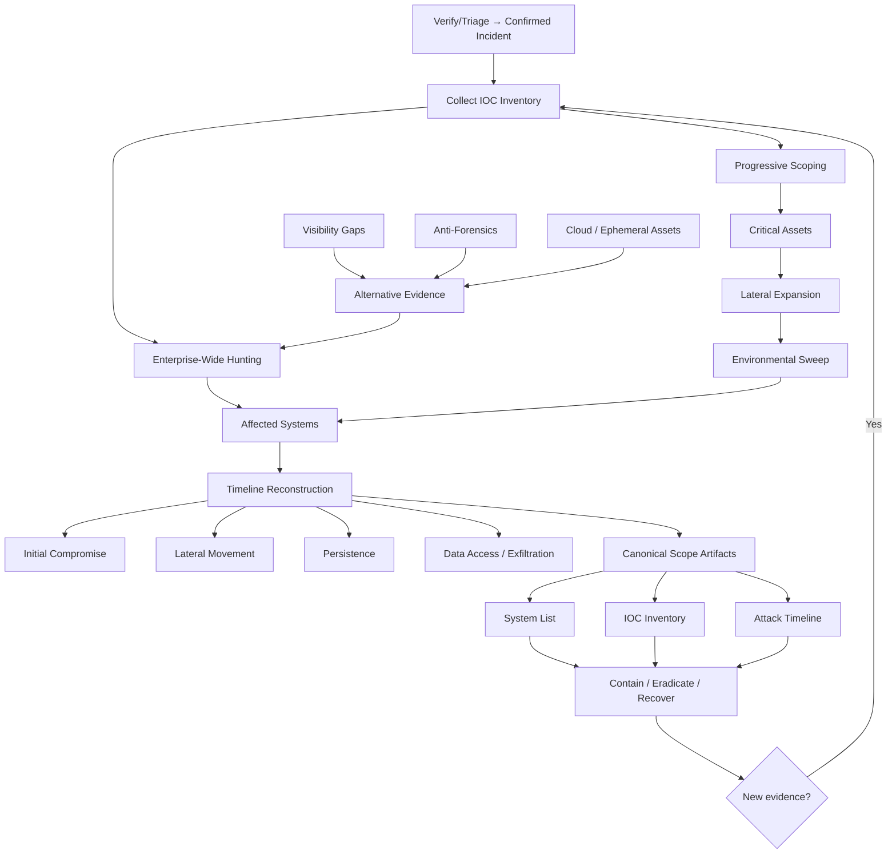

# Диаграмма: Scope Activity

```mermaid
flowchart TD
    A["Verify/Triage → Confirmed Incident"] --> B["Collect IOC Inventory"]

    B --> C["Enterprise-Wide Hunting"]
    B --> D["Progressive Scoping"]

    D --> D1["Critical Assets"]
    D1 --> D2["Lateral Expansion"]
    D2 --> D3["Environmental Sweep"]

    C --> E["Affected Systems"]
    D3 --> E

    E --> F["Timeline Reconstruction"]
    F --> G["Initial Compromise"]
    F --> H["Lateral Movement"]
    F --> I["Persistence"]
    F --> J["Data Access / Exfiltration"]

    K["Visibility Gaps"] --> L["Alternative Evidence"]
    M["Anti-Forensics"] --> L
    N["Cloud / Ephemeral Assets"] --> L
    L --> C

    F --> O["Canonical Scope Artifacts"]
    O --> P["System List"]
    O --> Q["IOC Inventory"]
    O --> R["Attack Timeline"]

    P --> S["Contain / Eradicate / Recover"]
    Q --> S
    R --> S

    S --> T{"New evidence?"}
    T -->|Yes| B
```

## Interpretation

Scope имеет два постоянных feedback loops:

- evidence → wider search;
- downstream response → new evidence → re-scope.
