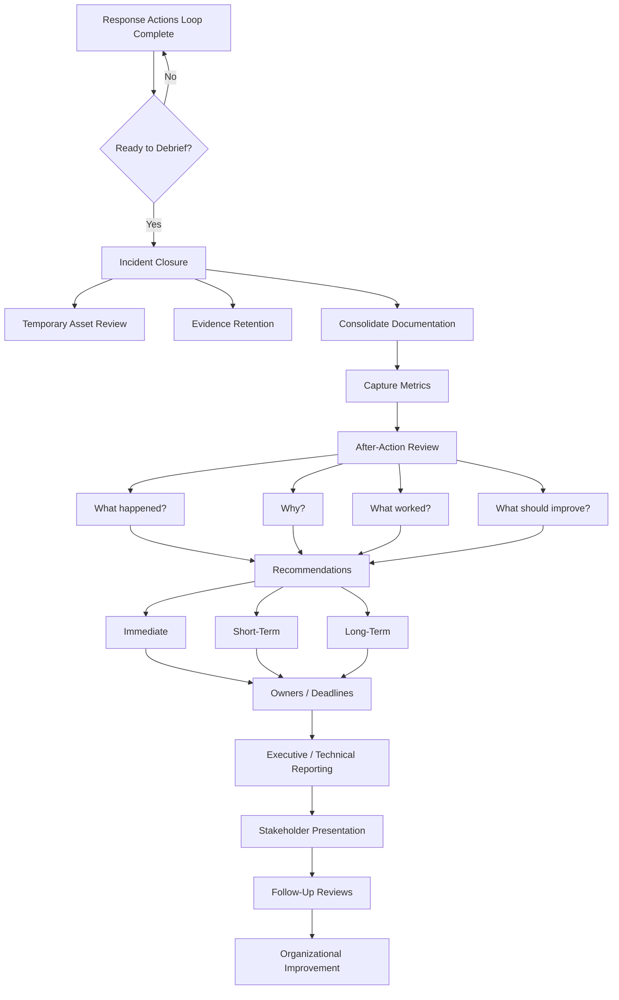

# Диаграмма: Debrief Activity

```mermaid
flowchart TD
    A["Response Actions Loop Complete"] --> B{"Ready to Debrief?"}

    B -->|No| A
    B -->|Yes| C["Incident Closure"]

    C --> D["Temporary Asset Review"]
    C --> E["Evidence Retention"]
    C --> F["Consolidate Documentation"]

    F --> G["Capture Metrics"]
    G --> H["After-Action Review"]

    H --> I["What happened?"]
    H --> J["Why?"]
    H --> K["What worked?"]
    H --> L["What should improve?"]

    I --> M["Recommendations"]
    J --> M
    K --> M
    L --> M

    M --> N["Immediate"]
    M --> O["Short-Term"]
    M --> P["Long-Term"]

    N --> Q["Owners / Deadlines"]
    O --> Q
    P --> Q

    Q --> R["Executive / Technical Reporting"]
    R --> S["Stakeholder Presentation"]
    S --> T["Follow-Up Reviews"]
    T --> U["Organizational Improvement"]
```

## Interpretation

Debrief is not passive reflection.

The process must convert observations into:
- owned work;
- funded work;
- measurable follow-up.
