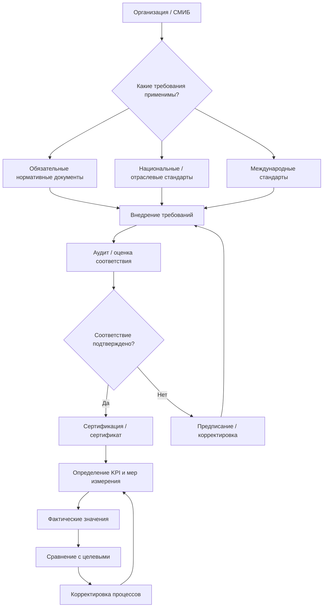
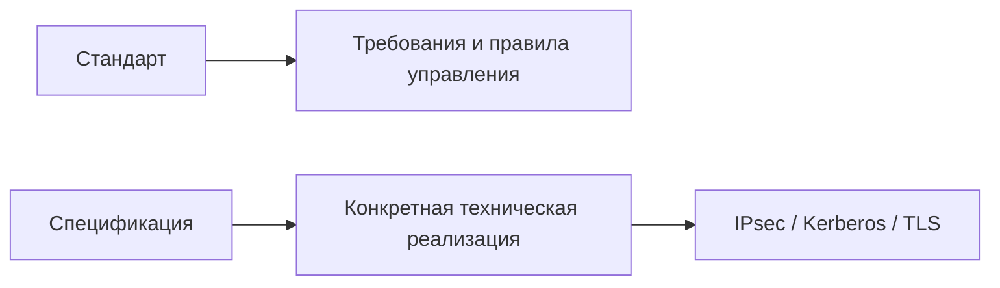
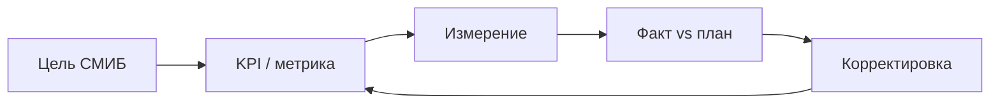

# Диаграмма: стандартизация → сертификация → измерение

```mermaid
flowchart TD
    A["Организация / СМИБ"] --> B{"Какие требования применимы?"}
    B --> C["Обязательные нормативные документы"]
    B --> D["Национальные / отраслевые стандарты"]
    B --> E["Международные стандарты"]

    C --> F["Внедрение требований"]
    D --> F
    E --> F

    F --> G["Аудит / оценка соответствия"]
    G --> H{"Соответствие подтверждено?"}
    H -->|Да| I["Сертификация / сертификат"]
    H -->|Нет| J["Предписание / корректировка"]
    J --> F

    I --> K["Определение KPI и мер измерения"]
    K --> L["Фактические значения"]
    L --> M["Сравнение с целевыми"]
    M --> N["Корректировка процессов"]
    N --> K
```

## Стандарт и спецификация

```mermaid
flowchart LR
    A["Стандарт"] --> B["Требования и правила управления"]
    C["Спецификация"] --> D["Конкретная техническая реализация"]
    D --> E["IPsec / Kerberos / TLS"]
```

## Измерение эффективности

```mermaid
flowchart LR
    A["Цель СМИБ"] --> B["KPI / метрика"]
    B --> C["Измерение"]
    C --> D["Факт vs план"]
    D --> E["Корректировка"]
    E --> B
```

Диаграммы отражают только логику главы и не добавляют внешних требований.
