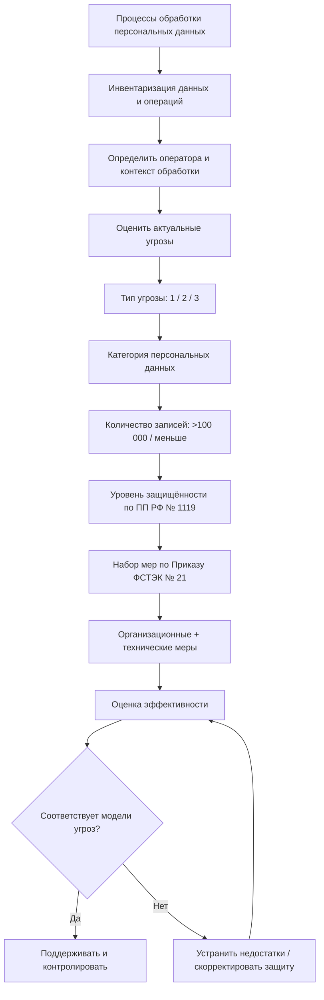
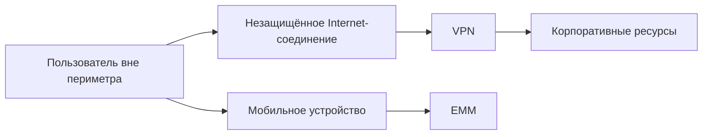
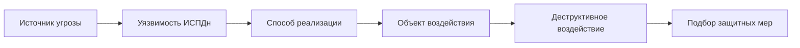

# Диаграмма: защита персональных данных по главе 3

```mermaid
flowchart TD
    A["Процессы обработки персональных данных"] --> B["Инвентаризация данных и операций"]
    B --> C["Определить оператора и контекст обработки"]
    C --> D["Оценить актуальные угрозы"]
    D --> E["Тип угрозы: 1 / 2 / 3"]
    E --> F["Категория персональных данных"]
    F --> G["Количество записей: >100 000 / меньше"]
    G --> H["Уровень защищённости по ПП РФ № 1119"]
    H --> I["Набор мер по Приказу ФСТЭК № 21"]
    I --> J["Организационные + технические меры"]
    J --> K["Оценка эффективности"]
    K --> L{"Соответствует модели угроз?"}
    L -->|Да| M["Поддерживать и контролировать"]
    L -->|Нет| N["Устранить недостатки / скорректировать защиту"]
    N --> K
```

## Контекст обработки вне периметра

```mermaid
flowchart LR
    A["Пользователь вне периметра"] --> B["Незащищённое Internet-соединение"]
    B --> C["VPN"]
    C --> D["Корпоративные ресурсы"]
    A --> E["Мобильное устройство"]
    E --> F["EMM"]
```

## Модель угроз

```mermaid
flowchart LR
    A["Источник угрозы"] --> B["Уязвимость ИСПДн"]
    B --> C["Способ реализации"]
    C --> D["Объект воздействия"]
    D --> E["Деструктивное воздействие"]
    E --> F["Подбор защитных мер"]
```

Диаграммы отражают только логику RAG главы.
