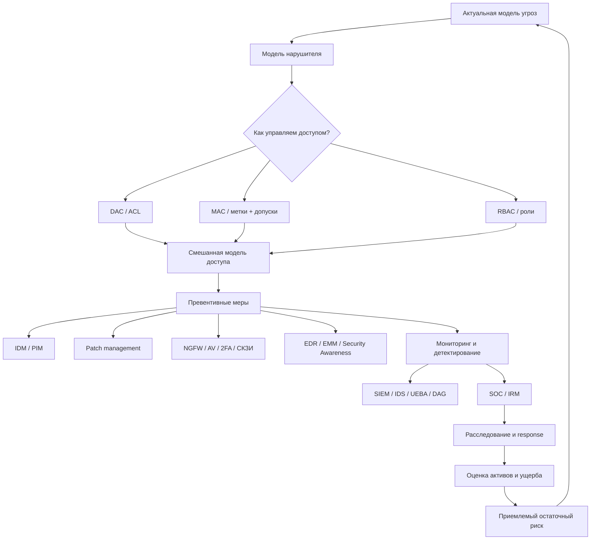
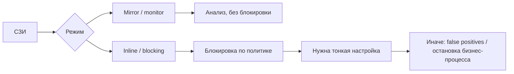
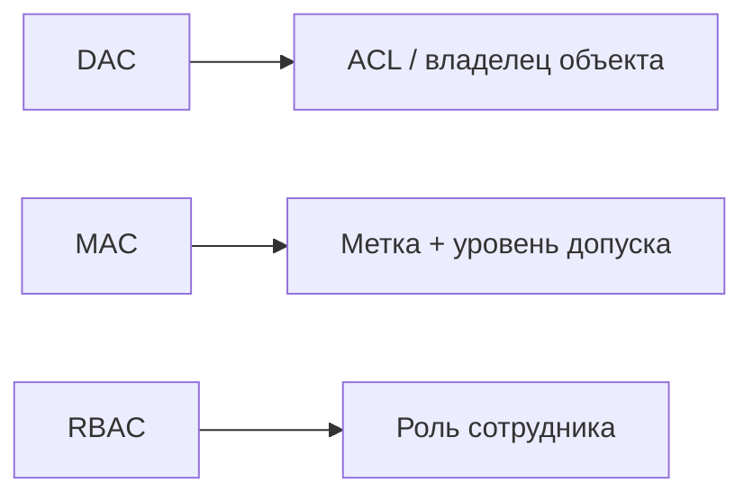

# Диаграмма: защита от НСД по главе 4

```mermaid
flowchart TD
    A["Актуальная модель угроз"] --> B["Модель нарушителя"]
    B --> C{"Как управляем доступом?"}
    C --> D["DAC / ACL"]
    C --> E["MAC / метки + допуски"]
    C --> F["RBAC / роли"]

    D --> G["Смешанная модель доступа"]
    E --> G
    F --> G

    G --> H["Превентивные меры"]
    H --> H1["IDM / PIM"]
    H --> H2["Patch management"]
    H --> H3["NGFW / AV / 2FA / СКЗИ"]
    H --> H4["EDR / EMM / Security Awareness"]

    H --> I["Мониторинг и детектирование"]
    I --> I1["SIEM / IDS / UEBA / DAG"]
    I --> J["SOC / IRM"]
    J --> K["Расследование и response"]

    K --> L["Оценка активов и ущерба"]
    L --> M["Приемлемый остаточный риск"]
    M --> A
```

## Monitor vs blocking

```mermaid
flowchart LR
    A["СЗИ"] --> B{"Режим"}
    B --> C["Mirror / monitor"]
    C --> D["Анализ, без блокировки"]
    B --> E["Inline / blocking"]
    E --> F["Блокировка по политике"]
    F --> G["Нужна тонкая настройка"]
    G --> H["Иначе: false positives / остановка бизнес-процесса"]
```

## Access control models

```mermaid
flowchart LR
    A["DAC"] --> A1["ACL / владелец объекта"]
    B["MAC"] --> B1["Метка + уровень допуска"]
    C["RBAC"] --> C1["Роль сотрудника"]
```

Диаграммы отражают только логику RAG главы.
