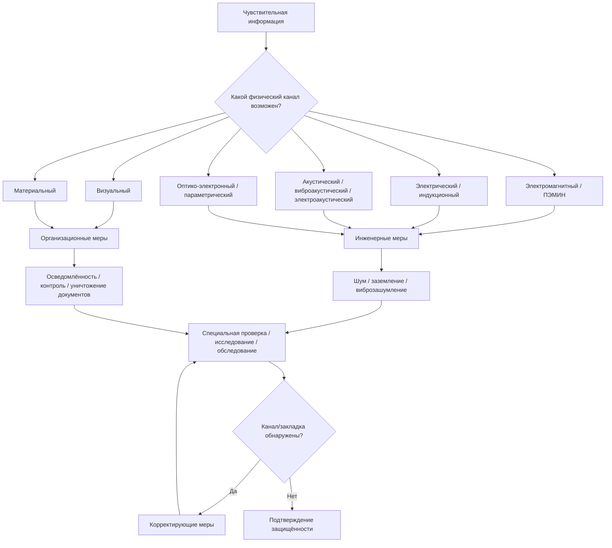
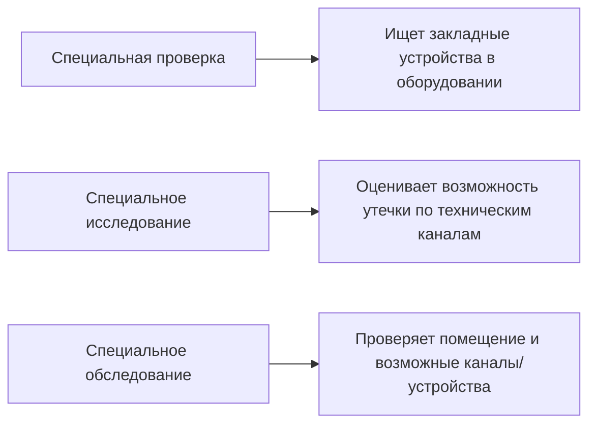
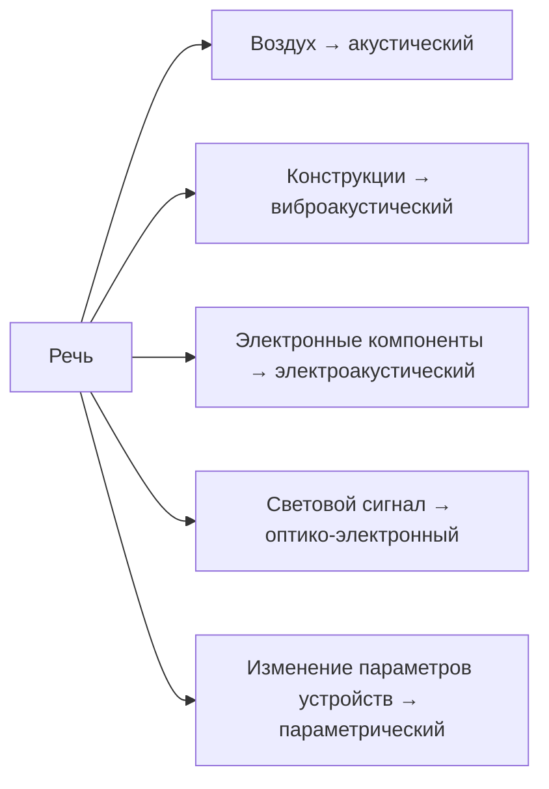

# Диаграмма: технические каналы утечки

```mermaid
flowchart TD
    A["Чувствительная информация"] --> B{"Какой физический канал возможен?"}
    B --> C["Электромагнитный / ПЭМИН"]
    B --> D["Электрический / индукционный"]
    B --> E["Акустический / виброакустический / электроакустический"]
    B --> F["Оптико-электронный / параметрический"]
    B --> G["Визуальный"]
    B --> H["Материальный"]

    C --> I["Инженерные меры"]
    D --> I
    E --> I
    F --> I
    G --> J["Организационные меры"]
    H --> J

    I --> I1["Шум / заземление / виброзашумление"]
    J --> J1["Осведомлённость / контроль / уничтожение документов"]

    I1 --> K["Специальная проверка / исследование / обследование"]
    J1 --> K

    K --> L{"Канал/закладка обнаружены?"}
    L -->|Да| M["Корректирующие меры"]
    L -->|Нет| N["Подтверждение защищённости"]
    M --> K
```

## Различие видов работ

```mermaid
flowchart LR
    A["Специальная проверка"] --> A1["Ищет закладные устройства в оборудовании"]
    B["Специальное исследование"] --> B1["Оценивает возможность утечки по техническим каналам"]
    C["Специальное обследование"] --> C1["Проверяет помещение и возможные каналы/устройства"]
```

## Речевая информация

```mermaid
flowchart LR
    A["Речь"] --> B["Воздух → акустический"]
    A --> C["Конструкции → виброакустический"]
    A --> D["Электронные компоненты → электроакустический"]
    A --> E["Световой сигнал → оптико-электронный"]
    A --> F["Изменение параметров устройств → параметрический"]
```

Диаграммы отражают только логику RAG главы.
