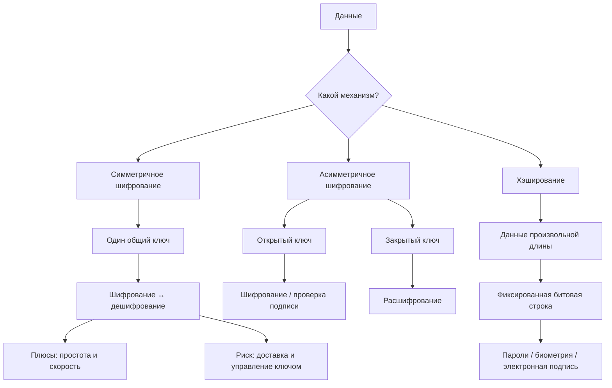
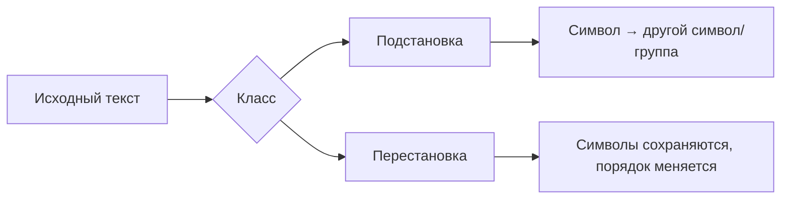
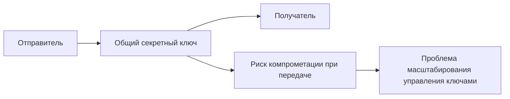

# Диаграмма: криптографическая защита по главе 6

```mermaid
flowchart TD
    A["Данные"] --> B{"Какой механизм?"}

    B --> C["Симметричное шифрование"]
    C --> C1["Один общий ключ"]
    C1 --> C2["Шифрование ↔ дешифрование"]
    C2 --> C3["Плюсы: простота и скорость"]
    C2 --> C4["Риск: доставка и управление ключом"]

    B --> D["Асимметричное шифрование"]
    D --> D1["Открытый ключ"]
    D --> D2["Закрытый ключ"]
    D1 --> D3["Шифрование / проверка подписи"]
    D2 --> D4["Расшифрование"]

    B --> E["Хэширование"]
    E --> E1["Данные произвольной длины"]
    E1 --> E2["Фиксированная битовая строка"]
    E2 --> E3["Пароли / биометрия / электронная подпись"]
```

## Подстановка и перестановка

```mermaid
flowchart LR
    A["Исходный текст"] --> B{"Класс"}
    B --> C["Подстановка"]
    C --> C1["Символ → другой символ/группа"]
    B --> D["Перестановка"]
    D --> D1["Символы сохраняются, порядок меняется"]
```

## Ключевая проблема симметричной схемы

```mermaid
flowchart LR
    A["Отправитель"] --> B["Общий секретный ключ"]
    B --> C["Получатель"]
    B --> D["Риск компрометации при передаче"]
    D --> E["Проблема масштабирования управления ключами"]
```

Диаграммы отражают только логику RAG главы.
