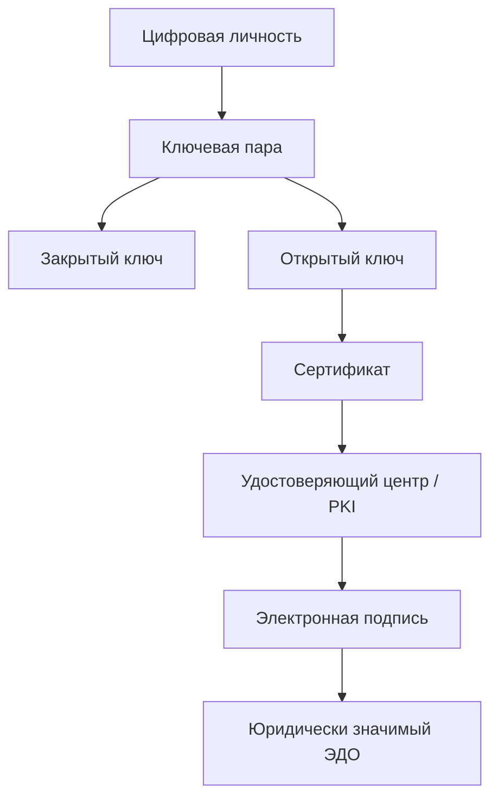
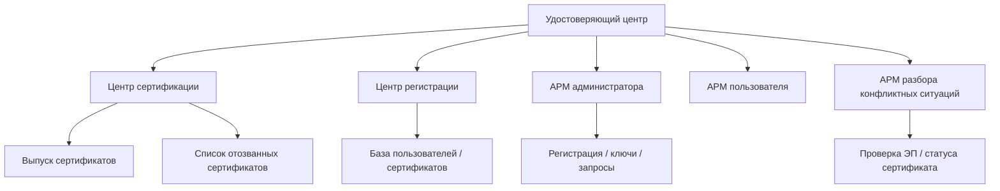
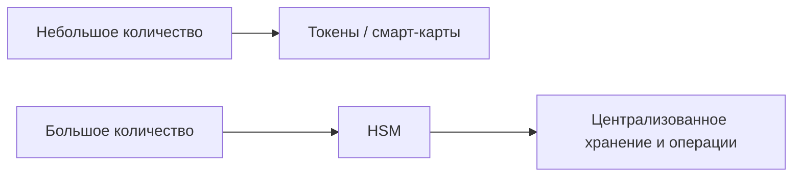

# Диаграмма: PKI и электронная подпись по главе 7

```mermaid
flowchart TD
    A["Цифровая личность"] --> B["Ключевая пара"]
    B --> C["Закрытый ключ"]
    B --> D["Открытый ключ"]
    D --> E["Сертификат"]
    E --> F["Удостоверяющий центр / PKI"]
    F --> G["Электронная подпись"]
    G --> H["Юридически значимый ЭДО"]
```

## Структура УЦ

```mermaid
flowchart TD
    A["Удостоверяющий центр"] --> B["Центр сертификации"]
    A --> C["Центр регистрации"]
    A --> D["АРМ администратора"]
    A --> E["АРМ пользователя"]
    A --> F["АРМ разбора конфликтных ситуаций"]

    B --> B1["Выпуск сертификатов"]
    B --> B2["Список отозванных сертификатов"]
    C --> C1["База пользователей / сертификатов"]
    D --> D1["Регистрация / ключи / запросы"]
    F --> F1["Проверка ЭП / статуса сертификата"]
```

## Масштабирование хранения ключей

```mermaid
flowchart LR
    A["Небольшое количество"] --> B["Токены / смарт-карты"]
    C["Большое количество"] --> D["HSM"]
    D --> E["Централизованное хранение и операции"]
```

Диаграммы отражают только содержание RAG главы.
