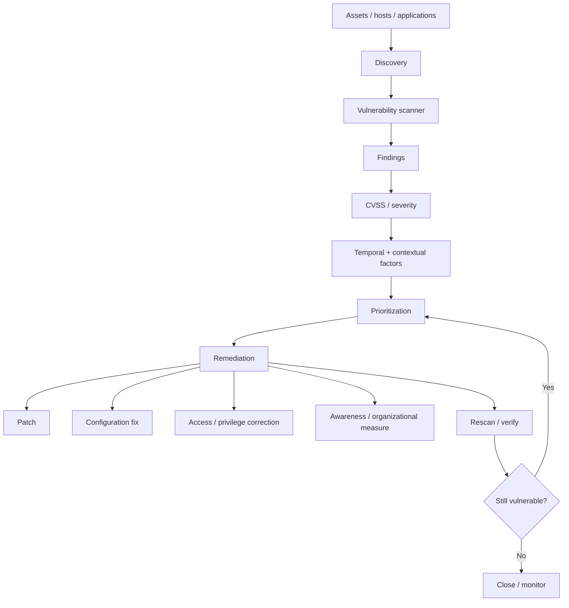
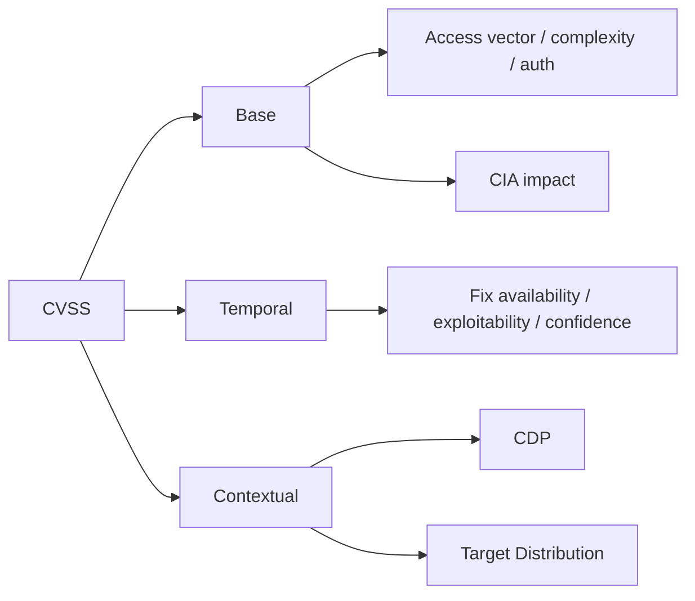
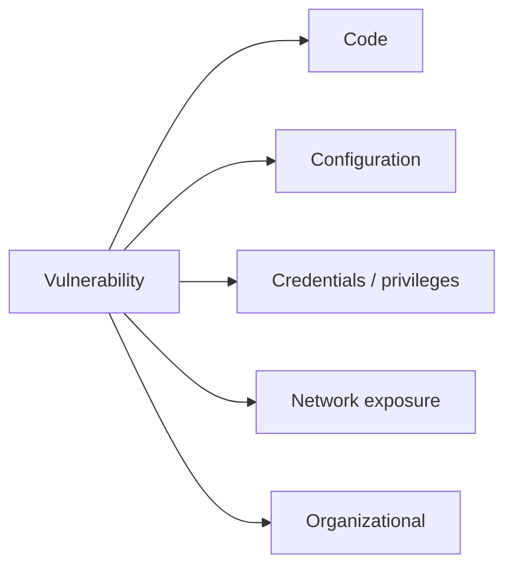

# Диаграмма: vulnerability management по главе 8

```mermaid
flowchart TD
    A["Assets / hosts / applications"] --> B["Discovery"]
    B --> C["Vulnerability scanner"]
    C --> D["Findings"]
    D --> E["CVSS / severity"]
    E --> F["Temporal + contextual factors"]
    F --> G["Prioritization"]
    G --> H["Remediation"]
    H --> H1["Patch"]
    H --> H2["Configuration fix"]
    H --> H3["Access / privilege correction"]
    H --> H4["Awareness / organizational measure"]
    H --> I["Rescan / verify"]
    I --> J{"Still vulnerable?"}
    J -->|Yes| G
    J -->|No| K["Close / monitor"]
```

## CVSS structure in source

```mermaid
flowchart LR
    A["CVSS"] --> B["Base"]
    A --> C["Temporal"]
    A --> D["Contextual"]
    B --> B1["Access vector / complexity / auth"]
    B --> B2["CIA impact"]
    C --> C1["Fix availability / exploitability / confidence"]
    D --> D1["CDP"]
    D --> D2["Target Distribution"]
```

## Vulnerability classes

```mermaid
flowchart LR
    A["Vulnerability"] --> B["Code"]
    A --> C["Configuration"]
    A --> D["Credentials / privileges"]
    A --> E["Network exposure"]
    A --> F["Organizational"]
```

Диаграммы отражают только содержание RAG главы.
