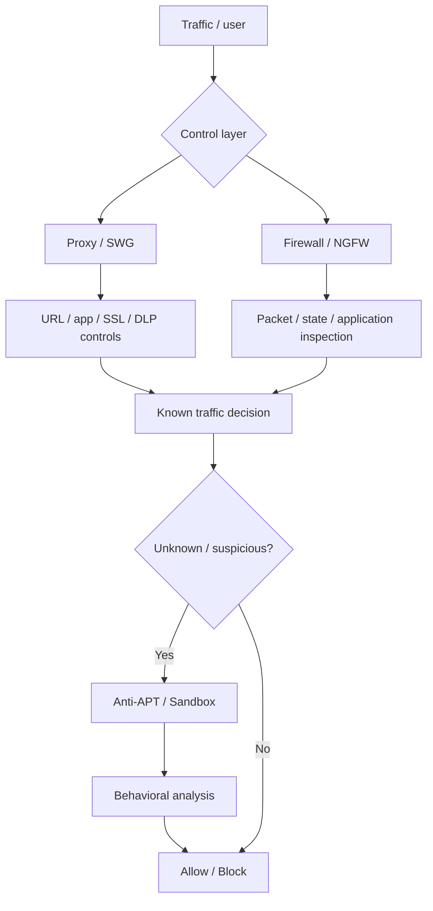
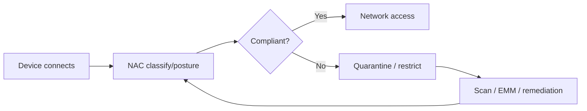
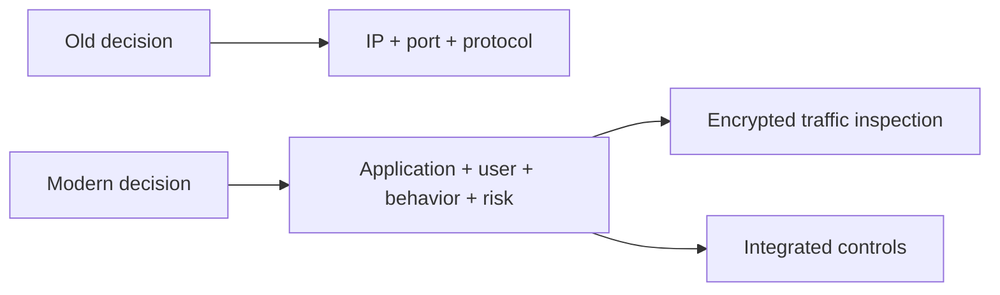

# Диаграмма: сетевая безопасность по главе 9

```mermaid
flowchart TD
    A["Traffic / user"] --> B{"Control layer"}
    B --> C["Proxy / SWG"]
    B --> D["Firewall / NGFW"]

    C --> C1["URL / app / SSL / DLP controls"]
    D --> D1["Packet / state / application inspection"]

    C1 --> E["Known traffic decision"]
    D1 --> E

    E --> F{"Unknown / suspicious?"}
    F -->|Yes| G["Anti-APT / Sandbox"]
    G --> H["Behavioral analysis"]
    H --> I["Allow / Block"]

    F -->|No| I
```

## NAC enforcement

```mermaid
flowchart LR
    A["Device connects"] --> B["NAC classify/posture"]
    B --> C{"Compliant?"}
    C -->|Yes| D["Network access"]
    C -->|No| E["Quarantine / restrict"]
    E --> F["Scan / EMM / remediation"]
    F --> B
```

## Modern paradigm in source

```mermaid
flowchart LR
    A["Old decision"] --> B["IP + port + protocol"]
    C["Modern decision"] --> D["Application + user + behavior + risk"]
    D --> E["Encrypted traffic inspection"]
    D --> F["Integrated controls"]
```

Диаграммы отражают только содержание RAG главы.
