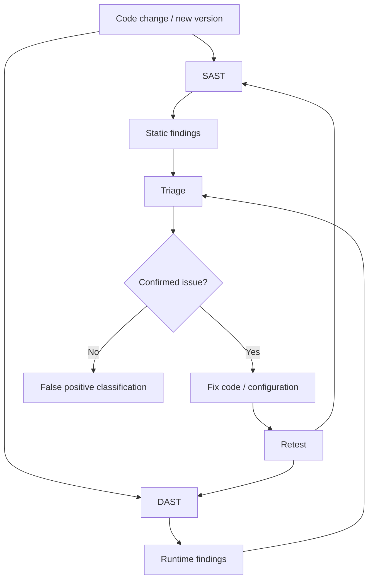
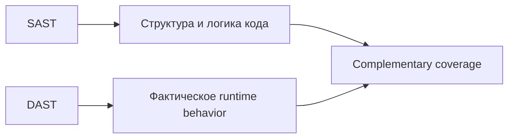
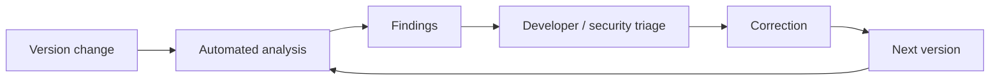

# Диаграмма: безопасная разработка по главе 10

```mermaid
flowchart TD
    A["Code change / new version"] --> B["SAST"]
    A --> C["DAST"]

    B --> D["Static findings"]
    C --> E["Runtime findings"]

    D --> F["Triage"]
    E --> F

    F --> G{"Confirmed issue?"}
    G -->|Yes| H["Fix code / configuration"]
    G -->|No| I["False positive classification"]

    H --> J["Retest"]
    J --> B
    J --> C
```

## Почему нужны оба подхода

```mermaid
flowchart LR
    A["SAST"] --> A1["Структура и логика кода"]
    B["DAST"] --> B1["Фактическое runtime behavior"]
    A1 --> C["Complementary coverage"]
    B1 --> C
```

## Development integration

```mermaid
flowchart LR
    A["Version change"] --> B["Automated analysis"]
    B --> C["Findings"]
    C --> D["Developer / security triage"]
    D --> E["Correction"]
    E --> F["Next version"]
    F --> B
```

Диаграммы отражают только содержание RAG главы.
