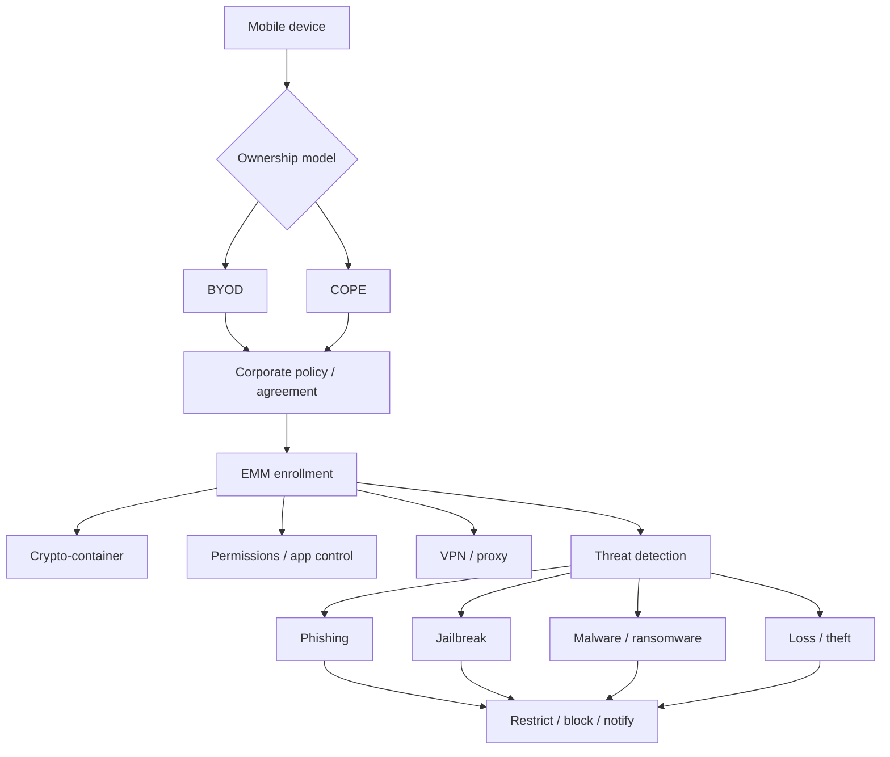
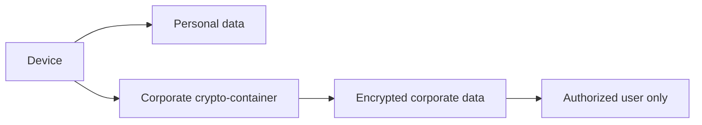
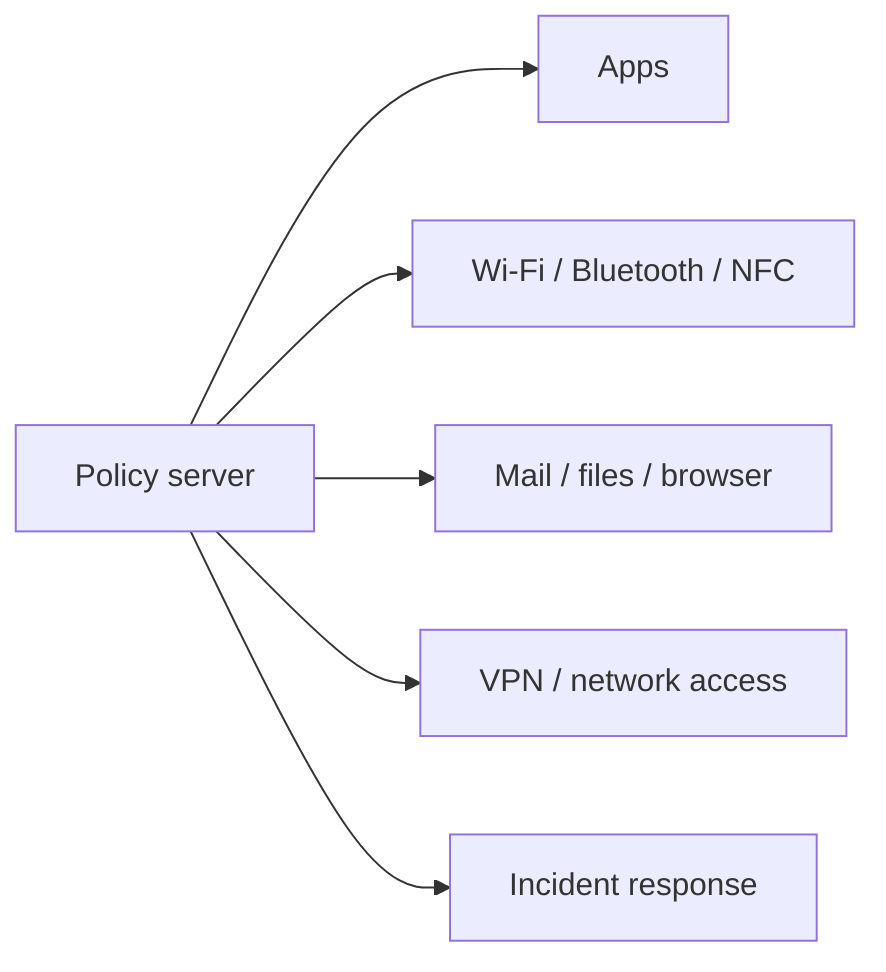

# Диаграмма: mobile security по главе 11

```mermaid
flowchart TD
    A["Mobile device"] --> B{"Ownership model"}
    B --> C["BYOD"]
    B --> D["COPE"]

    C --> E["Corporate policy / agreement"]
    D --> E

    E --> F["EMM enrollment"]
    F --> G["Crypto-container"]
    F --> H["Permissions / app control"]
    F --> I["VPN / proxy"]
    F --> J["Threat detection"]

    J --> J1["Phishing"]
    J --> J2["Jailbreak"]
    J --> J3["Malware / ransomware"]
    J --> J4["Loss / theft"]

    J1 --> K["Restrict / block / notify"]
    J2 --> K
    J3 --> K
    J4 --> K
```

## Data separation

```mermaid
flowchart LR
    A["Device"] --> B["Personal data"]
    A --> C["Corporate crypto-container"]
    C --> D["Encrypted corporate data"]
    D --> E["Authorized user only"]
```

## Policy-driven controls

```mermaid
flowchart LR
    A["Policy server"] --> B["Apps"]
    A --> C["Wi-Fi / Bluetooth / NFC"]
    A --> D["Mail / files / browser"]
    A --> E["VPN / network access"]
    A --> F["Incident response"]
```

Диаграммы отражают только содержание RAG главы.
