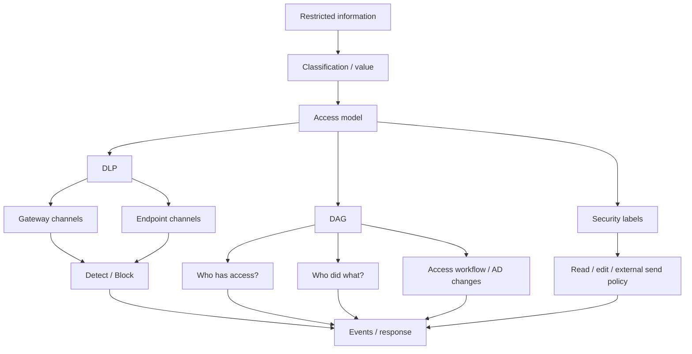
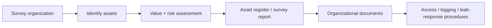

# Диаграмма: DLP + DAG + labels

```mermaid
flowchart TD
    A["Restricted information"] --> B["Classification / value"]
    B --> C["Access model"]

    C --> D["DLP"]
    C --> E["DAG"]
    C --> F["Security labels"]

    D --> D1["Gateway channels"]
    D --> D2["Endpoint channels"]
    D1 --> D3["Detect / Block"]
    D2 --> D3

    E --> E1["Who has access?"]
    E --> E2["Who did what?"]
    E --> E3["Access workflow / AD changes"]

    F --> F1["Read / edit / external send policy"]

    D3 --> G["Events / response"]
    E1 --> G
    E2 --> G
    E3 --> G
    F1 --> G
```

## Commercial-secret project

```mermaid
flowchart LR
    A["Survey organization"] --> B["Identify assets"]
    B --> C["Value + risk assessment"]
    C --> D["Asset register / survey report"]
    D --> E["Organizational documents"]
    E --> F["Access / logging / leak-response procedures"]
```

Диаграммы отражают только содержание RAG главы.
