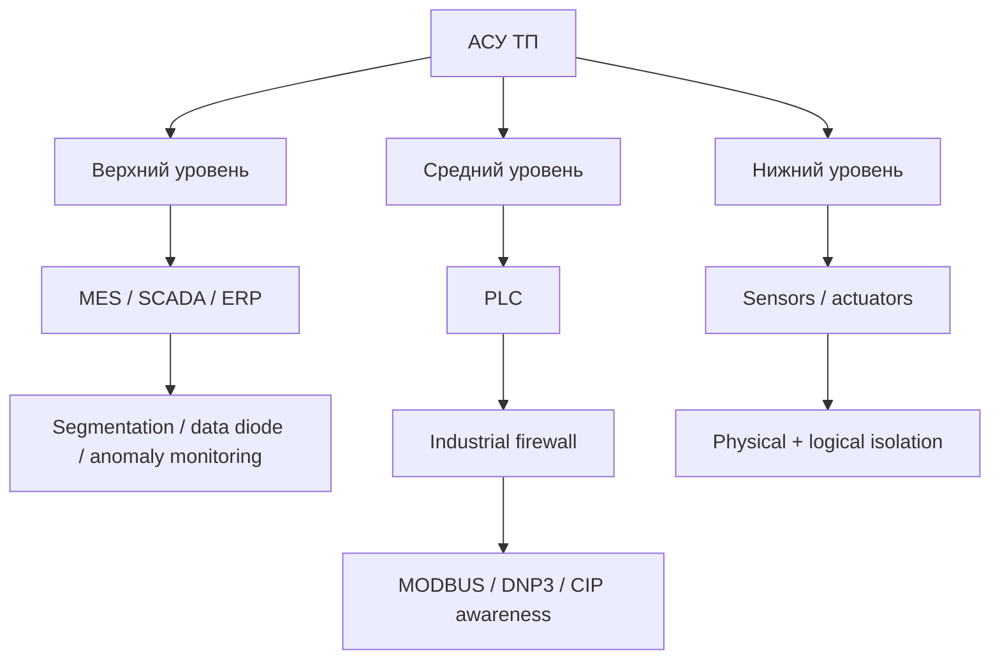
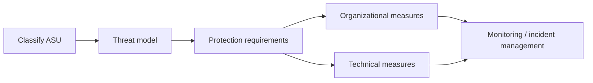
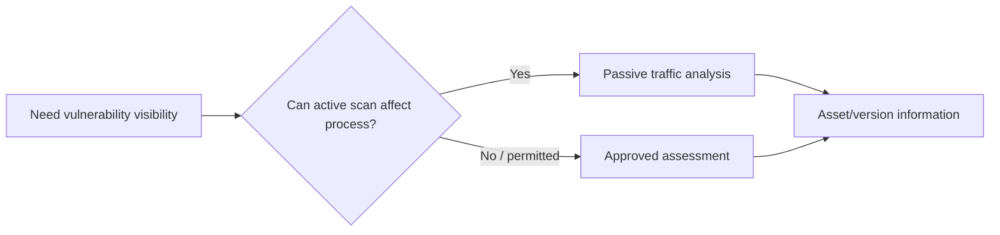

# Диаграмма: защита АСУ ТП

```mermaid
flowchart TD
    A["АСУ ТП"] --> B["Верхний уровень"]
    A --> C["Средний уровень"]
    A --> D["Нижний уровень"]

    B --> B1["MES / SCADA / ERP"]
    B1 --> B2["Segmentation / data diode / anomaly monitoring"]

    C --> C1["PLC"]
    C1 --> C2["Industrial firewall"]
    C2 --> C3["MODBUS / DNP3 / CIP awareness"]

    D --> D1["Sensors / actuators"]
    D1 --> D2["Physical + logical isolation"]
```

## Protection project

```mermaid
flowchart LR
    A["Classify ASU"] --> B["Threat model"]
    B --> C["Protection requirements"]
    C --> D["Organizational measures"]
    C --> E["Technical measures"]
    D --> F["Monitoring / incident management"]
    E --> F
```

## Vulnerability-management constraint

```mermaid
flowchart LR
    A["Need vulnerability visibility"] --> B{"Can active scan affect process?"}
    B -->|Yes| C["Passive traffic analysis"]
    B -->|No / permitted| D["Approved assessment"]
    C --> E["Asset/version information"]
    D --> E
```

Диаграммы отражают только содержание RAG главы.
