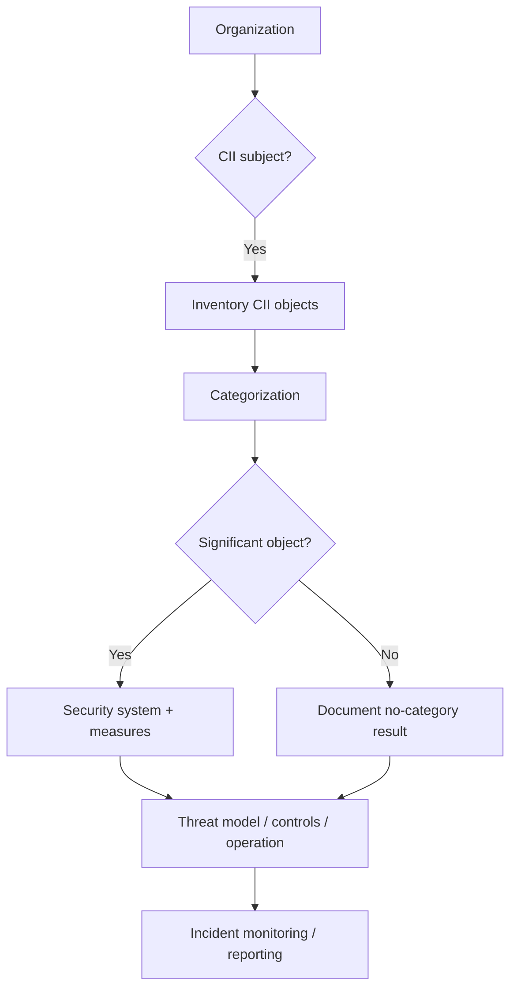
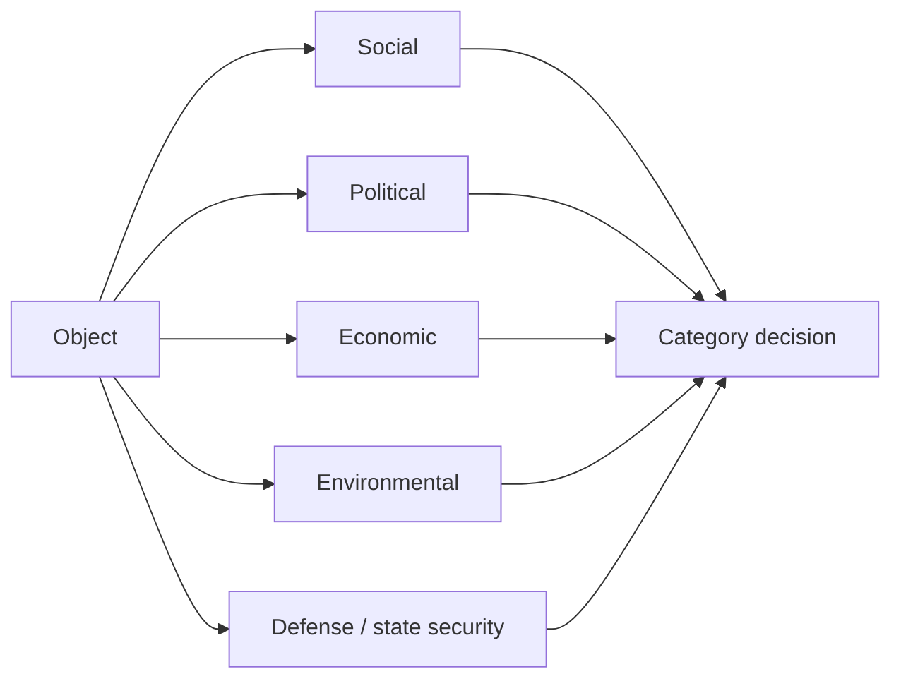
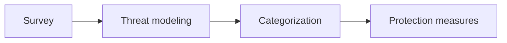

# Диаграмма: защита КИИ по главе 14

```mermaid
flowchart TD
    A["Organization"] --> B{"CII subject?"}
    B -->|Yes| C["Inventory CII objects"]
    C --> D["Categorization"]
    D --> E{"Significant object?"}
    E -->|Yes| F["Security system + measures"]
    E -->|No| G["Document no-category result"]
    F --> H["Threat model / controls / operation"]
    G --> H
    H --> I["Incident monitoring / reporting"]
```

## Categorization factors

```mermaid
flowchart LR
    A["Object"] --> B["Social"]
    A --> C["Political"]
    A --> D["Economic"]
    A --> E["Environmental"]
    A --> F["Defense / state security"]
    B --> G["Category decision"]
    C --> G
    D --> G
    E --> G
    F --> G
```

## Compliance project

```mermaid
flowchart LR
    A["Survey"] --> B["Threat modeling"]
    B --> C["Categorization"]
    C --> D["Protection measures"]
```

Диаграммы отражают только содержание RAG главы.
