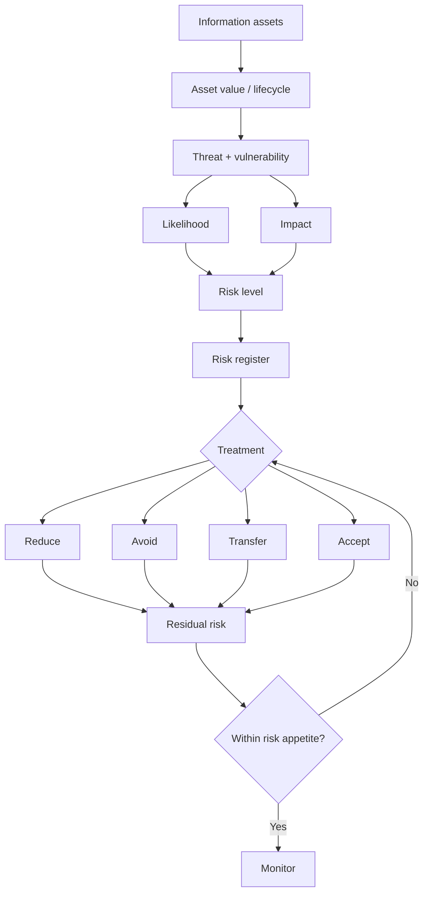
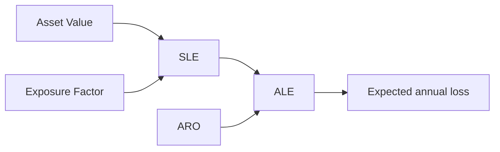

# Диаграмма: оценка рисков ИБ

```mermaid
flowchart TD
    A["Information assets"] --> B["Asset value / lifecycle"]
    B --> C["Threat + vulnerability"]
    C --> D["Likelihood"]
    C --> E["Impact"]
    D --> F["Risk level"]
    E --> F

    F --> G["Risk register"]
    G --> H{"Treatment"}
    H --> H1["Reduce"]
    H --> H2["Avoid"]
    H --> H3["Transfer"]
    H --> H4["Accept"]

    H1 --> I["Residual risk"]
    H2 --> I
    H3 --> I
    H4 --> I

    I --> J{"Within risk appetite?"}
    J -->|No| H
    J -->|Yes| K["Monitor"]
```

## Quantitative model

```mermaid
flowchart LR
    A["Asset Value"] --> B["SLE"]
    C["Exposure Factor"] --> B
    B --> D["ALE"]
    E["ARO"] --> D
    D --> F["Expected annual loss"]
```

Диаграммы отражают только содержание RAG главы.
