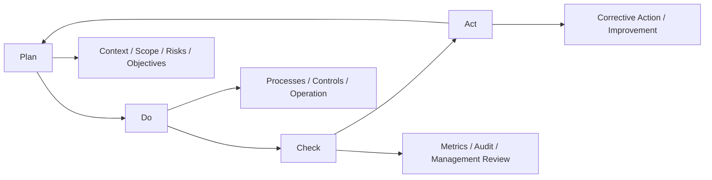
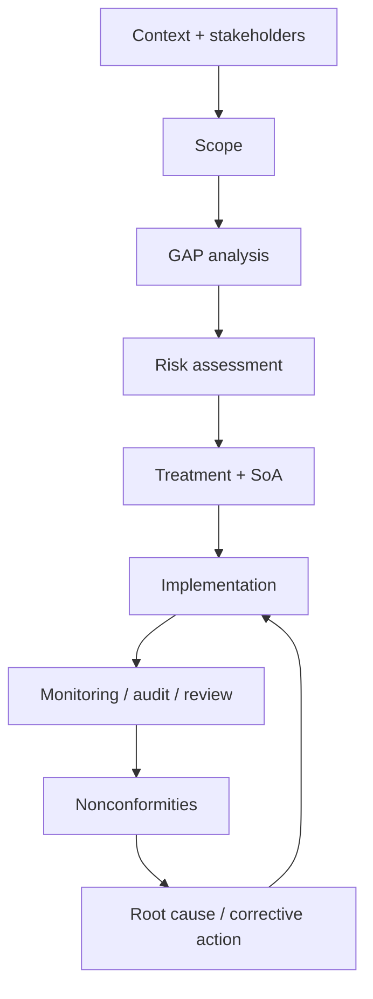
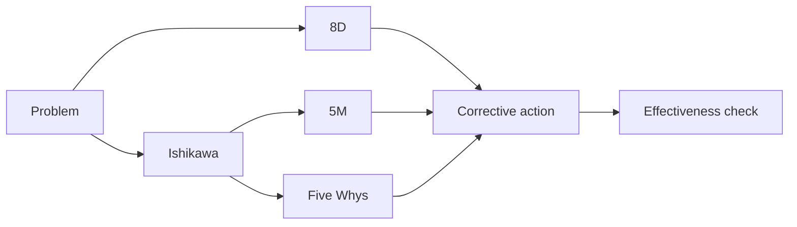

# Диаграмма: ISO 27001 / СУИБ

```mermaid
flowchart LR
    A["Plan"] --> B["Do"]
    B --> C["Check"]
    C --> D["Act"]
    D --> A

    A --> A1["Context / Scope / Risks / Objectives"]
    B --> B1["Processes / Controls / Operation"]
    C --> C1["Metrics / Audit / Management Review"]
    D --> D1["Corrective Action / Improvement"]
```

## Внедрение СУИБ

```mermaid
flowchart TD
    A["Context + stakeholders"] --> B["Scope"]
    B --> C["GAP analysis"]
    C --> D["Risk assessment"]
    D --> E["Treatment + SoA"]
    E --> F["Implementation"]
    F --> G["Monitoring / audit / review"]
    G --> H["Nonconformities"]
    H --> I["Root cause / corrective action"]
    I --> F
```

## Problem solving

```mermaid
flowchart LR
    A["Problem"] --> B["8D"]
    A --> C["Ishikawa"]
    C --> D["5M"]
    C --> E["Five Whys"]
    B --> F["Corrective action"]
    D --> F
    E --> F
    F --> G["Effectiveness check"]
```

Диаграммы отражают только содержание RAG главы.
