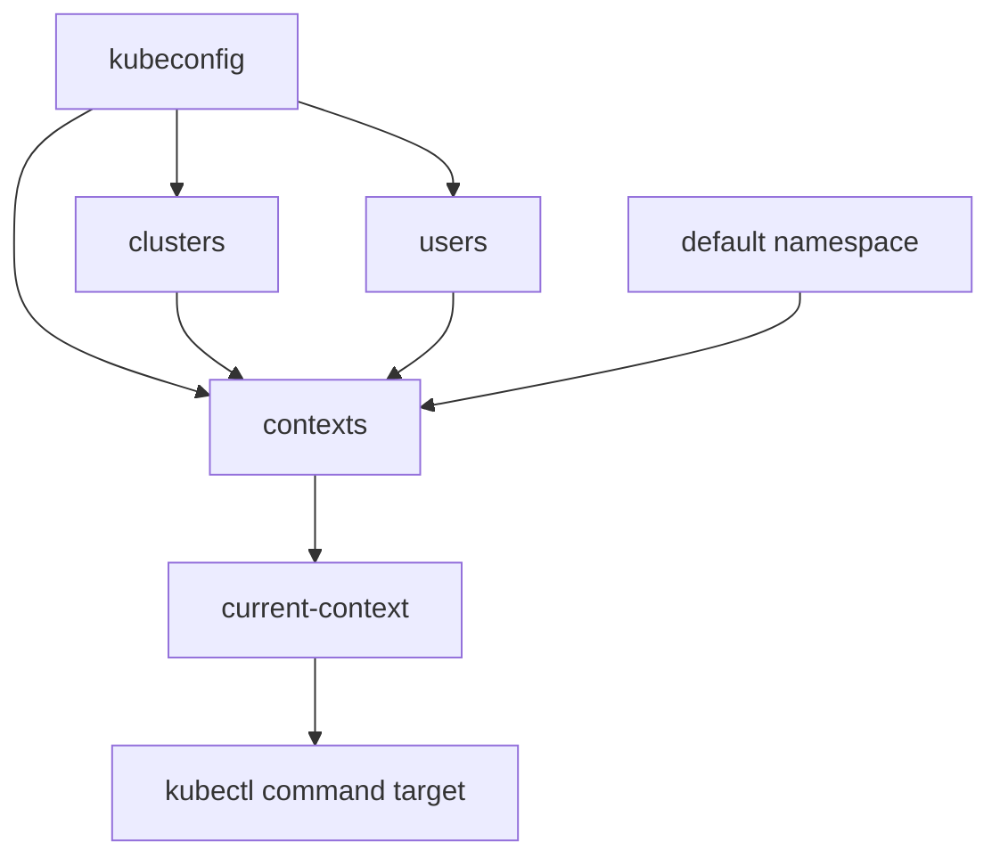
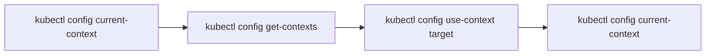

# Приложение A — diagram

```mermaid
flowchart TD
    K[kubeconfig] --> C[clusters]
    K --> U[users]
    K --> X[contexts]
    X --> CC[current-context]
    C --> X
    U --> X
    N[default namespace] --> X
    CC --> Kubectl[kubectl command target]
```

```mermaid
flowchart LR
    Check[kubectl config current-context] --> List[kubectl config get-contexts]
    List --> Switch[kubectl config use-context target]
    Switch --> Verify[kubectl config current-context]
```
