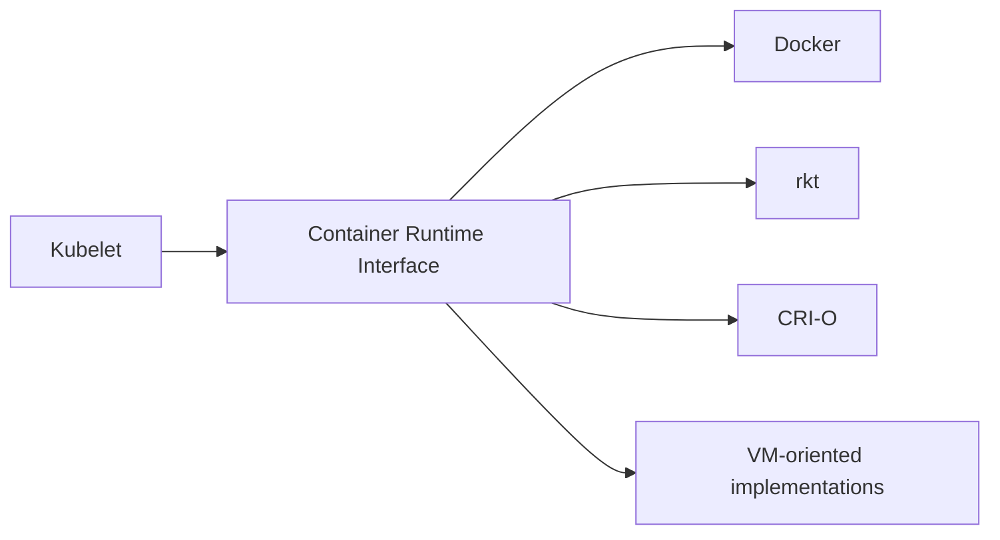
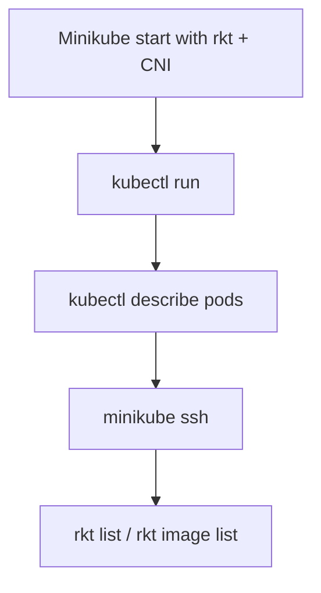

# Приложение C — diagrams

```mermaid
flowchart LR
    K[Kubelet] --> CRI[Container Runtime Interface]
    CRI --> D[Docker]
    CRI --> R[rkt]
    CRI --> O[CRI-O]
    CRI --> V[VM-oriented implementations]
```

```mermaid
flowchart TD
    Start[Minikube start with rkt + CNI] --> Run[kubectl run]
    Run --> Desc[kubectl describe pods]
    Desc --> SSH[minikube ssh]
    SSH --> List[rkt list / rkt image list]
```
