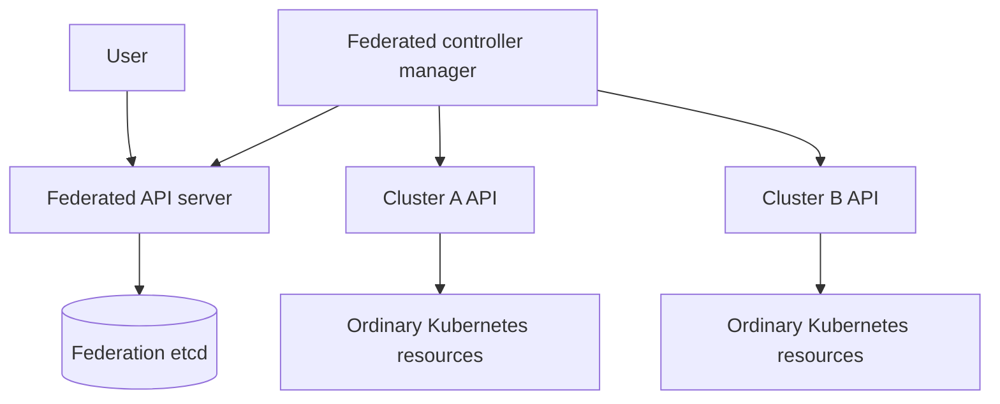
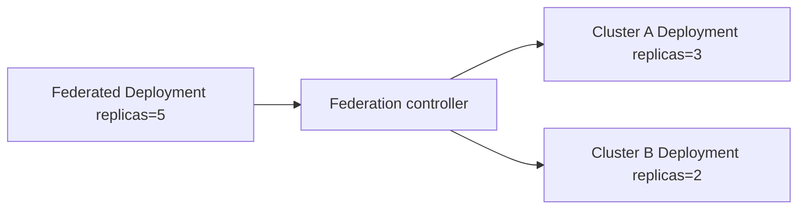
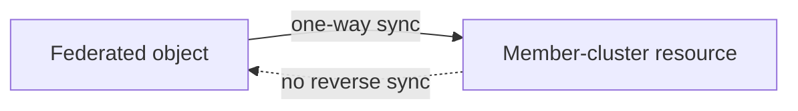

# Приложение D — diagrams

```mermaid
flowchart TD
  User[User] --> FAPI[Federated API server]
  FAPI --> FETCD[(Federation etcd)]
  FCM[Federated controller manager] --> FAPI
  FCM --> C1[Cluster A API]
  FCM --> C2[Cluster B API]
  C1 --> R1[Ordinary Kubernetes resources]
  C2 --> R2[Ordinary Kubernetes resources]
```

```mermaid
flowchart LR
  FR[Federated Deployment replicas=5] --> FC[Federation controller]
  FC --> A[Cluster A Deployment replicas=3]
  FC --> B[Cluster B Deployment replicas=2]
```

```mermaid
flowchart LR
  F[Federated object] -->|one-way sync| M[Member-cluster resource]
  M -. no reverse sync .-> F
```
