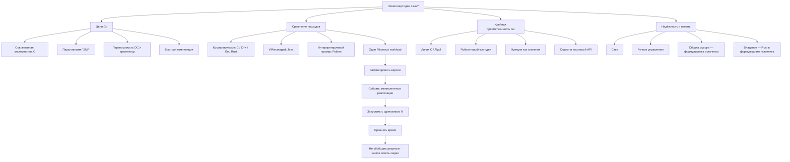

# Diagram — глава 1 «Предыстория Go»

```mermaid
flowchart TD
    A["Зачем ещё один язык?"] --> B["Цели Go"]
    B --> B1["Современная альтернатива C"]
    B --> B2["Параллелизм / SMP"]
    B --> B3["Переносимость ОС и архитектур"]
    B --> B4["Быстрая компиляция"]

    A --> C["Сравнение подходов"]
    C --> C1["Компилируемые: C / C++ / Go / Rust"]
    C --> C2["VM/managed: Java"]
    C --> C3["Интерпретируемый пример: Python"]

    C --> D["Один Fibonacci workload"]
    D --> D1["Зафиксировать версии"]
    D1 --> D2["Собрать эквивалентные реализации"]
    D2 --> D3["Запустить с одинаковым N"]
    D3 --> D4["Сравнить время"]
    D4 --> E["Не обобщать результат на все классы задач"]

    A --> F["Идейная преемственность Go"]
    F --> F1["Линия C / Algol"]
    F --> F2["Python-подобные идеи"]
    F --> F3["Функции как значения"]
    F --> F4["Строки и текстовый API"]

    A --> G["Надёжность и память"]
    G --> G1["Стек"]
    G --> G2["Ручное управление"]
    G --> G3["Сборка мусора — формулировка источника"]
    G --> G4["Владение — Rust в формулировке источника"]
```
